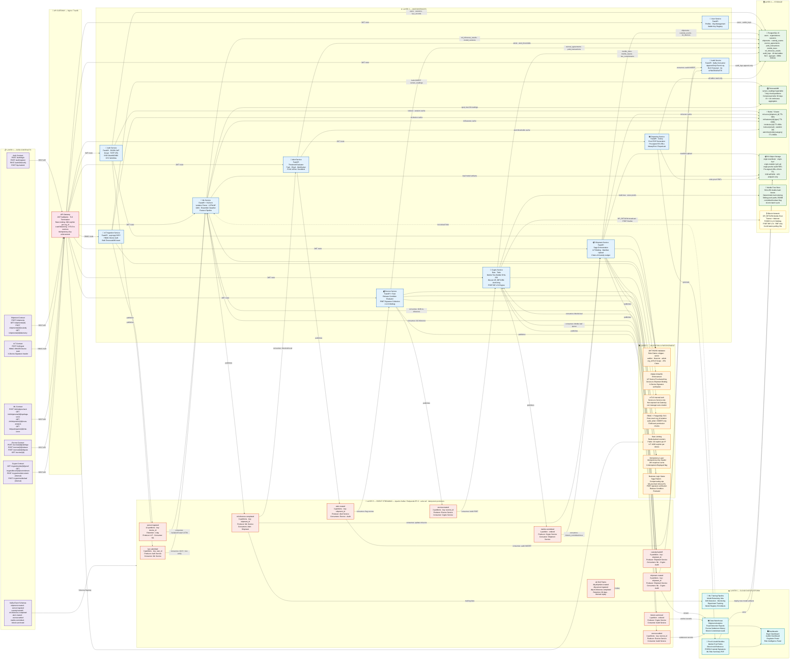

```mermaid
flowchart LR

    classDef data fill:#EDE7F6,stroke:#5E35B1,color:#000,stroke-width:2px
    classDef api fill:#E3F2FD,stroke:#1565C0,color:#000,stroke-width:2px
    classDef validation fill:#FFF3E0,stroke:#EF6C00,color:#000,stroke-width:2px
    classDef storage fill:#E8F5E9,stroke:#2E7D32,color:#000,stroke-width:2px
    classDef kafka fill:#FBE9E7,stroke:#D84315,color:#000,stroke-width:2px
    classDef cloud fill:#E0F7FA,stroke:#00838F,color:#000,stroke-width:2px
    classDef gateway fill:#FCE4EC,stroke:#C62828,color:#000,stroke-width:2px
    classDef bitcoin fill:#FFFDE7,stroke:#F9A825,color:#000,stroke-width:2px

    %% ═══════════════════════════════════════════════════
    %% LAYER 1 — DATA CONTRACTS
    %% ═══════════════════════════════════════════════════
    subgraph CONTRACTS["📋  LAYER 1 — DATA CONTRACTS"]
        direction TB
        DC_AUTH["Auth Contract<br/>POST /auth/login<br/>POST /auth/register<br/>POST /auth/2fa/verify<br/>POST /kyc/submit"]
        DC_SHIP["Shipment Contract<br/>POST /shipments<br/>GET /shipments/{id}<br/>POST /shipments/{id}/custody<br/>GET /shipments/{id}/telemetry"]
        DC_IOT["IoT Contract<br/>POST /iot/ingest<br/>HMAC-SHA256 Device Auth<br/>X-Device-Signature header"]
        DC_ML["ML Contract<br/>POST /ml/risk/precheck<br/>GET /ml/shipments/{id}/spoilage-score<br/>GET /ml/shipments/{id}/route-analysis<br/>GET /ml/participants/{id}/risk-score"]
        DC_ESC["Escrow Contract<br/>POST /escrow/{id}/psbt/sign<br/>POST /escrow/{id}/release<br/>POST /escrow/{id}/dispute<br/>GET /escrow/{id}"]
        DC_CRYPTO["Crypto Contract<br/>GET /crypto/merkle/{id}/proof<br/>GET /crypto/bitcoin/{id}/commitment<br/>POST /crypto/merkle/commit [internal]<br/>POST /crypto/merkle/leaf [internal]"]
        DC_EVT["Kafka Event Schemas<br/>shipment.created · sensor.ingested<br/>custody.handoff · ml.inference.completed<br/>alert.created · escrow.settled<br/>merkle.committed · bitcoin.anchored"]
    end

    %% ═══════════════════════════════════════════════════
    %% API GATEWAY
    %% ═══════════════════════════════════════════════════
    subgraph GATEWAY_LAYER["🔀  API GATEWAY — Nginx / Traefik"]
        GW["API Gateway<br/>JWT Validation · TLS Termination<br/>Rate Limiting: 300 req/min per org_id<br/>Load Balancing · mTLS to services<br/>Idempotency-Key enforcement"]
    end

    %% ═══════════════════════════════════════════════════
    %% LAYER 2 — MICROSERVICES
    %% ═══════════════════════════════════════════════════
    subgraph APIS["⚙️  LAYER 2 — MICROSERVICES"]
        direction TB
        SVC_AUTH["🔐 Auth Service<br/>FastAPI · RS256 JWT<br/>bcrypt · TOTP 2FA<br/>SSO OAuth2/OIDC<br/>KYC Workflow"]
        SVC_USER["👤 User Service<br/>FastAPI<br/>Profiles · Org Management<br/>Wallet Key Registry"]
        SVC_SHIP["📦 Shipment Service<br/>FastAPI<br/>Saga Orchestration<br/>IoT Binding · Manifest Upload<br/>Chain-of-Custody Ledger"]
        SVC_IOT["📡 IoT Ingestion Service<br/>FastAPI · asyncpg COPY<br/>HMAC Device Auth<br/>Bulk TimescaleDB Insert"]
        SVC_ML["🤖 ML Service<br/>FastAPI + PyTorch<br/>Isolation Forest · LSTM AE<br/>GNN · Ensemble Classifier<br/>Feature Pipeline"]
        SVC_ALERT["🔔 Alert Service<br/>FastAPI<br/>Threshold Evaluator<br/>Push · Email · WebSocket<br/>FCM / APNs / SendGrid"]
        SVC_ESC["💰 Escrow Service<br/>FastAPI + Rust<br/>Release Condition Evaluator<br/>PSBT Signature Collection<br/>2-of-3 Multisig"]
        SVC_CRYPTO["🔗 Crypto Service<br/>Rust · Tokio<br/>Merkle Tree Builder SHA-256<br/>Bitcoin OP_RETURN Anchoring<br/>PSBT BIP-174 Engine"]
        SVC_AUDIT["📝 Audit Service<br/>FastAPI · Kafka Consumer<br/>Append-Only Event Log<br/>RLS Protected · No UPDATE/DELETE"]
        SVC_REPORT["📊 Reporting Service<br/>FastAPI · Celery<br/>Proof PDF Generation<br/>Pre-signed S3 URLs<br/>WeasyPrint / ReportLab"]
    end

    %% ═══════════════════════════════════════════════════
    %% LAYER 3 — VALIDATION & ENFORCEMENT
    %% ═══════════════════════════════════════════════════
    subgraph VALIDATION["🛡️  LAYER 3 — VALIDATION & ENFORCEMENT"]
        direction TB
        VAL_JWT["JWT RS256 Validation<br/>Role Claims: shipper · carrier<br/>auditor · financier · admin<br/>org_id RLS Scope · 2FA Claim"]
        VAL_HMAC["HMAC-SHA256 Enforcement<br/>IoT Device Pre-shared Key<br/>Device-to-Shipment Binding<br/>X-Device-Signature verification"]
        VAL_MTLS["mTLS Internal Auth<br/>Service-to-Service only<br/>Not exposed via Gateway<br/>cert-manager auto-rotation"]
        VAL_RBAC["RBAC + PostgreSQL RLS<br/>Row-Level org_id isolation<br/>audit_writer: INSERT only<br/>Field-level permission checks"]
        VAL_RATE["Rate Limiting<br/>Redis-backed counters<br/>Public: 20 req/min per IP<br/>IoT: 1000 req/min per device"]
        VAL_IDEM["Idempotency Layer<br/>Idempotency-Key header<br/>24h response cache<br/>X-Idempotent-Replayed flag"]
        VAL_BIZ["Business Logic Gates<br/>Saga Pattern · Compensating ops<br/>ML precheck timeout 5s<br/>PSBT signature verification<br/>Release Condition Evaluator"]
    end

    %% ═══════════════════════════════════════════════════
    %% LAYER 4 — STORAGE
    %% ═══════════════════════════════════════════════════
    subgraph STORAGE["🗄️  LAYER 4 — STORAGE"]
        direction TB
        DB_PG["🐘 PostgreSQL 15<br/>users · organizations · sessions<br/>shipments · custody_events<br/>escrow_agreements · psbt_transactions<br/>merkle_trees · ml_inference_results<br/>audit_logs · 18 total tables<br/>RLS · pgcrypto · BRIN indexes"]
        DB_TS["⏱️ TimescaleDB<br/>sensor_readings hypertable<br/>7-day chunk partitions<br/>Compressed after 30 days<br/>1h + 1d continuous aggregates"]
        DB_REDIS["⚡ Redis 7 Cluster<br/>ml:score:{shipment_id} TTL 300s<br/>ml:features:{id}:{type} TTL 1800s<br/>iot:device:{id} TTL 600s<br/>lockout:{email} · ratelimit:{ip}<br/>alert:thresholds:{category} TTL 3600s"]
        DB_S3["📦 S3 Object Storage<br/>origin-manifests/ · origin-kyc/<br/>origin-models/ (.pkl .pt)<br/>origin-proofs/ audit PDFs<br/>Pre-signed URLs 15min TTL<br/>SSE-AES256 · VPC endpoint only"]
        DB_MERKLE["🌲 Merkle Tree Store<br/>SHA-256 double-hash leaves<br/>Deterministic leaf ordering<br/>Sibling proof paths JSONB<br/>committed boolean flag<br/>10-min batch cycle"]
        DB_BTC["₿ Bitcoin Network<br/>OP_RETURN Merkle Root<br/>Testnet + Mainnet<br/>P2WSH 2-of-3 Multisig<br/>PSBT BIP-174 · RBF retry<br/>Confirmation polling 30s"]
    end

    %% ═══════════════════════════════════════════════════
    %% LAYER 5 — KAFKA EVENT STREAMING
    %% ═══════════════════════════════════════════════════
    subgraph KAFKA_LAYER["📨  LAYER 5 — EVENT STREAMING — Apache Kafka / Redpanda  RF=3 · acks=all · idempotent producers"]
        direction TB
        K_SC["shipment.created<br/>6 partitions · key: shipment_id<br/>Producer: Shipment Service<br/>Consumers: ML · Crypto · Audit"]
        K_SI["sensor.ingested<br/>12 partitions · key: device_id<br/>Retention: 1 day<br/>Producer: IoT · Consumer: ML"]
        K_CH["custody.handoff<br/>6 partitions · key: shipment_id<br/>Producer: Shipment Service<br/>Consumers: ML · Crypto · Audit"]
        K_ML["ml.inference.completed<br/>6 partitions · key: shipment_id<br/>Producer: ML Service<br/>Consumers: Alert · Shipment"]
        K_AL["alert.created<br/>3 partitions · key: shipment_id<br/>Producer: Alert Service<br/>Consumers: Escrow · Audit"]
        K_EC["escrow.created<br/>3 partitions · key: escrow_id<br/>Producer: Escrow Service<br/>Consumer: Crypto Service"]
        K_ES["escrow.settled<br/>3 partitions · key: escrow_id<br/>Producer: Escrow Service<br/>Consumer: Audit Service"]
        K_MC["merkle.committed<br/>1 partition · ordered<br/>Producer: Crypto Service<br/>Consumer: Shipment Service"]
        K_BA["bitcoin.anchored<br/>1 partition · ordered<br/>Producer: Crypto Service<br/>Consumer: Audit Service"]
        K_KYC["kyc.submitted<br/>3 partitions · key: user_id<br/>Producer: Auth Service<br/>Consumer: ML Service"]
        K_DLQ["⚠️ DLQ Topics<br/>dlq.shipment.created<br/>dlq.sensor.ingested<br/>dlq.ml.inference.completed<br/>Retention: 30 days · Manual replay"]
    end

    %% ═══════════════════════════════════════════════════
    %% LAYER 6 — CLOUD DATA PLATFORM
    %% ═══════════════════════════════════════════════════
    subgraph CLOUD["☁️  LAYER 6 — CLOUD DATA PLATFORM"]
        direction TB
        CDP_DW["📊 Data Warehouse<br/>Shipment Analytics<br/>Fraud Detection Reports<br/>Escrow Settlement History<br/>Bitcoin Commitment Audit"]
        CDP_ML["🧠 ML Training Pipeline<br/>Model Retraining Jobs<br/>Drift Detection · Monitoring<br/>Experiment Tracking<br/>Model Registry S3 Artifacts"]
        CDP_DASH["🖥️ Dashboards<br/>Buyer Dashboard<br/>Auditor Dashboard<br/>Regulator Portal<br/>Risk Intelligence Panel"]
        CDP_PROOF["📄 Proof & Audit Bundles<br/>Merkle Proof Paths<br/>Bitcoin txid Reference<br/>ECDSA Custody Signatures<br/>ML Risk Summary PDF"]
    end

    %% ═══════════════════════════════════════════════════
    %% CONNECTIONS — Data Contracts → Gateway
    %% ═══════════════════════════════════════════════════
    DC_AUTH -->|"REST API"| GW
    DC_SHIP -->|"REST API"| GW
    DC_IOT -->|"HMAC Auth"| GW
    DC_ML -->|"REST API"| GW
    DC_ESC -->|"REST API"| GW
    DC_CRYPTO -->|"REST API"| GW
    DC_EVT -->|"Schema Registry"| KAFKA_LAYER

    %% Gateway → Services
    GW -->|"JWT route"| SVC_AUTH
    GW -->|"JWT route"| SVC_USER
    GW -->|"JWT route"| SVC_SHIP
    GW -->|"HMAC route"| SVC_IOT
    GW -->|"JWT route"| SVC_ML
    GW -->|"JWT route"| SVC_ALERT
    GW -->|"JWT route"| SVC_ESC
    GW -->|"JWT route"| SVC_CRYPTO
    GW -->|"JWT route"| SVC_AUDIT
    GW -->|"JWT route"| SVC_REPORT

    %% Services → Validation
    SVC_AUTH --> VAL_JWT
    SVC_SHIP --> VAL_JWT
    SVC_ML --> VAL_JWT
    SVC_ESC --> VAL_RBAC
    SVC_IOT --> VAL_HMAC
    SVC_CRYPTO --> VAL_MTLS
    GW --> VAL_RATE
    SVC_SHIP --> VAL_IDEM
    SVC_ESC --> VAL_IDEM
    SVC_SHIP --> VAL_BIZ
    SVC_ESC --> VAL_BIZ

    %% Services → PostgreSQL
    SVC_AUTH -->|"users · sessions · kyc_records"| DB_PG
    SVC_USER -->|"users · wallet_keys"| DB_PG
    SVC_SHIP -->|"shipments · custody_events · iot_devices"| DB_PG
    SVC_ML -->|"ml_inference_results · model_versions"| DB_PG
    SVC_ALERT -->|"alerts · alert_thresholds"| DB_PG
    SVC_ESC -->|"escrow_agreements · psbt_transactions"| DB_PG
    SVC_CRYPTO -->|"merkle_trees · merkle_leaves · btc_commitments"| DB_PG
    SVC_AUDIT -->|"audit_logs append-only"| DB_PG
    SVC_REPORT -->|"all tables read-only"| DB_PG

    %% Services → TimescaleDB
    SVC_IOT -->|"bulk INSERT sensor_readings"| DB_TS
    SVC_ML -->|"query last 60 readings"| DB_TS

    %% Services → Redis
    SVC_AUTH -->|"lockout · session cache"| DB_REDIS
    SVC_SHIP -->|"ml:score cache"| DB_REDIS
    SVC_IOT -->|"iot:device cache"| DB_REDIS
    SVC_ML -->|"ml:features cache"| DB_REDIS
    SVC_ALERT -->|"alert:thresholds cache"| DB_REDIS

    %% Services → S3
    SVC_SHIP -->|"manifest upload"| DB_S3
    SVC_ML -->|"load model artifacts"| DB_S3
    SVC_REPORT -->|"write proof PDFs"| DB_S3

    %% Crypto → Merkle + Bitcoin
    SVC_CRYPTO -->|"build tree · store proofs"| DB_MERKLE
    SVC_CRYPTO -->|"OP_RETURN broadcast · PSBT finalize"| DB_BTC

    %% Services → Kafka PRODUCERS
    SVC_AUTH -->|"publishes"| K_KYC
    SVC_SHIP -->|"publishes"| K_SC
    SVC_SHIP -->|"publishes"| K_CH
    SVC_IOT -->|"publishes"| K_SI
    SVC_ML -->|"publishes"| K_ML
    SVC_ALERT -->|"publishes"| K_AL
    SVC_ESC -->|"publishes"| K_EC
    SVC_ESC -->|"publishes"| K_ES
    SVC_CRYPTO -->|"publishes"| K_MC
    SVC_CRYPTO -->|"publishes"| K_BA

    %% Kafka → Services CONSUMERS
    K_SC -->|"consumes: full inference"| SVC_ML
    K_SC -->|"consumes: Merkle leaf queue"| SVC_CRYPTO
    K_SC -->|"consumes: audit INSERT"| SVC_AUDIT
    K_SI -->|"consumes: IsolationForest+LSTM"| SVC_ML
    K_CH -->|"consumes: GNN re-inference"| SVC_ML
    K_CH -->|"consumes: Merkle leaf"| SVC_CRYPTO
    K_ML -->|"consumes: threshold eval"| SVC_ALERT
    K_ML -->|"consumes: update ml:score"| SVC_SHIP
    K_AL -->|"consumes: flag escrow"| SVC_ESC
    K_AL -->|"consumes: audit INSERT"| SVC_AUDIT
    K_EC -->|"consumes: build PSBT"| SVC_CRYPTO
    K_KYC -->|"consumes: OCR + doc verify"| SVC_ML
    K_MC -->|"consumes: bitcoin_committed=true"| SVC_SHIP
    K_DLQ -.->|"manual replay"| KAFKA_LAYER

    %% Kafka → Cloud Data Platform
    K_SC -->|"stream"| CDP_DW
    K_ML -->|"training data"| CDP_ML
    K_BA -->|"anchor records"| CDP_DW
    K_ES -->|"settlement records"| CDP_DW

    %% Cloud Data Platform internals
    CDP_DW --> CDP_DASH
    CDP_ML -->|"deploy new model artifacts"| DB_S3
    CDP_ML -.->|"hot-reload 5min"| SVC_ML
    SVC_REPORT -->|"generate"| CDP_PROOF
    CDP_PROOF -->|"store"| DB_S3
    CDP_PROOF --> CDP_DASH

    %% ═══════════════════════════════════════════════════
    %% CLASS ASSIGNMENTS
    %% ═══════════════════════════════════════════════════
    class DC_AUTH,DC_SHIP,DC_IOT,DC_ML,DC_ESC,DC_CRYPTO,DC_EVT data
    class GW gateway
    class SVC_AUTH,SVC_USER,SVC_SHIP,SVC_IOT,SVC_ML,SVC_ALERT,SVC_ESC,SVC_CRYPTO,SVC_AUDIT,SVC_REPORT api
    class VAL_JWT,VAL_HMAC,VAL_MTLS,VAL_RBAC,VAL_RATE,VAL_IDEM,VAL_BIZ validation
    class DB_PG,DB_TS,DB_REDIS,DB_S3,DB_MERKLE storage
    class DB_BTC bitcoin
    class K_SC,K_SI,K_CH,K_ML,K_AL,K_EC,K_ES,K_MC,K_BA,K_KYC,K_DLQ kafka
    class CDP_DW,CDP_ML,CDP_DASH,CDP_PROOF cloud
```
