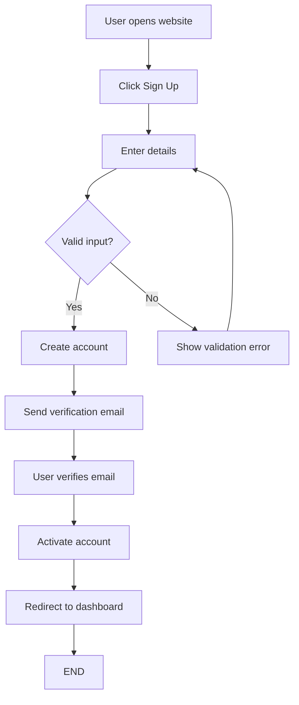
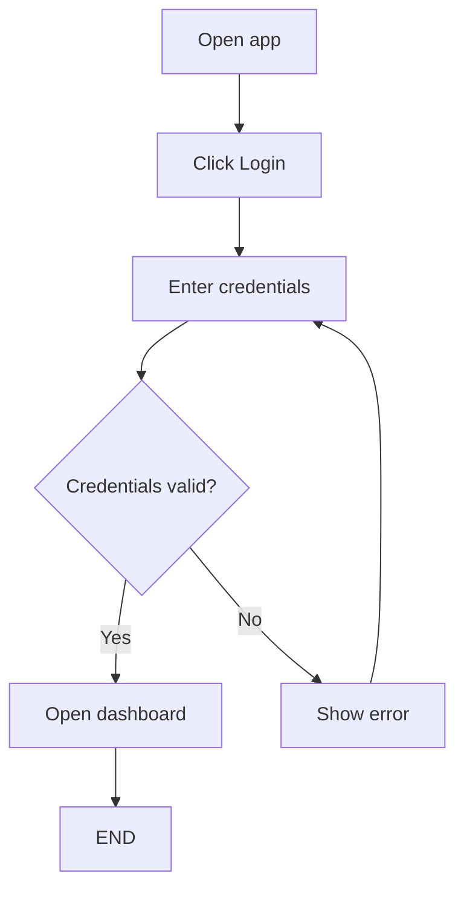
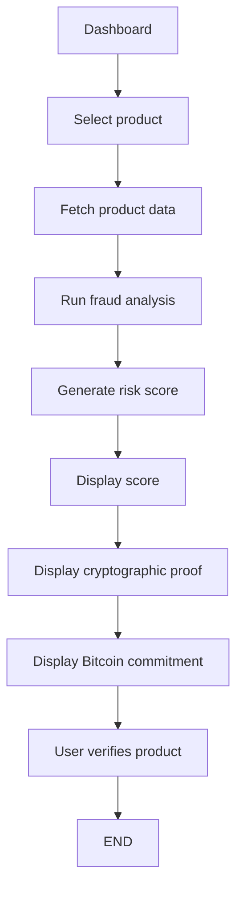
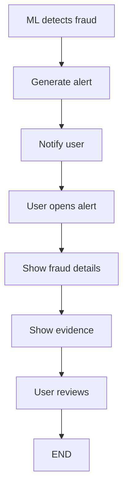
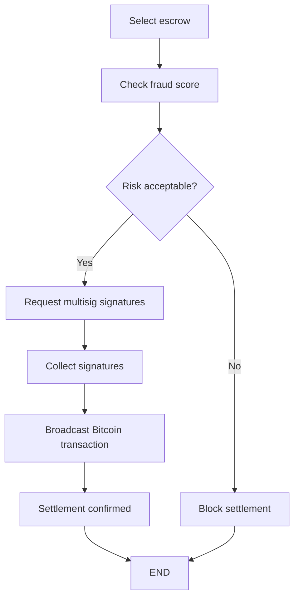
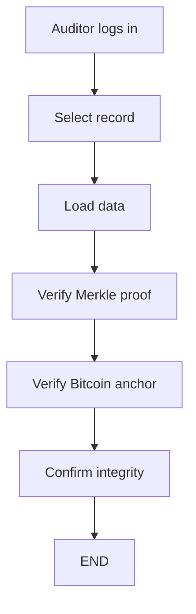
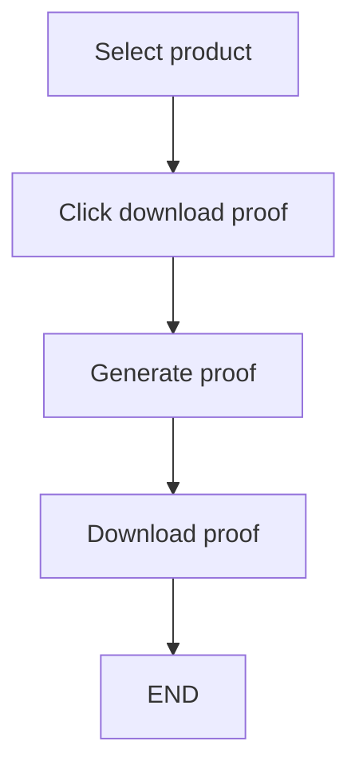
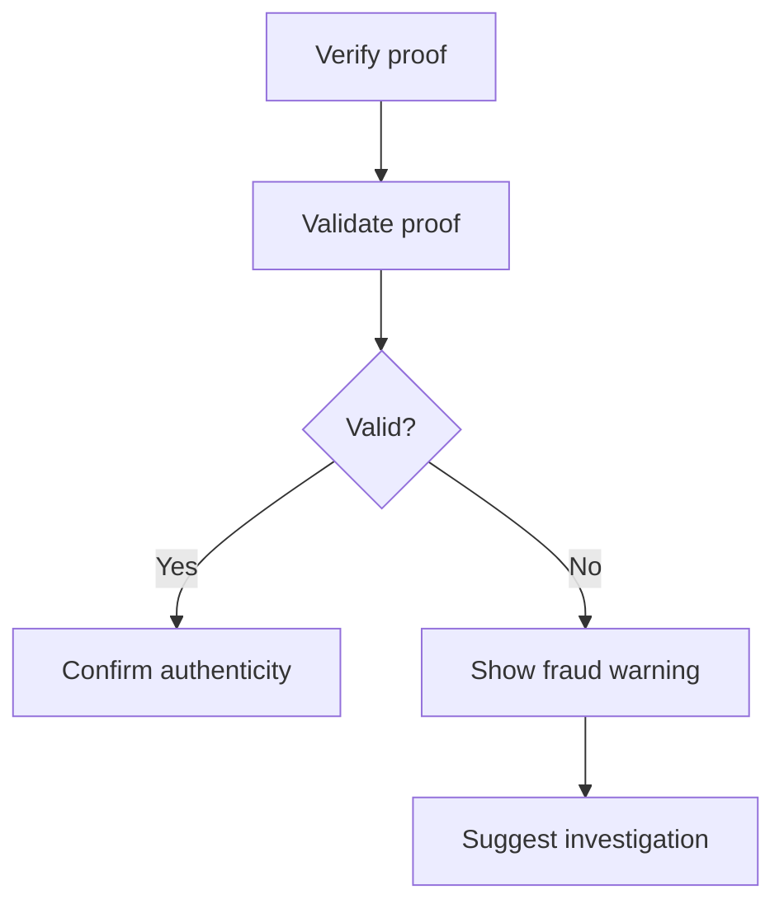
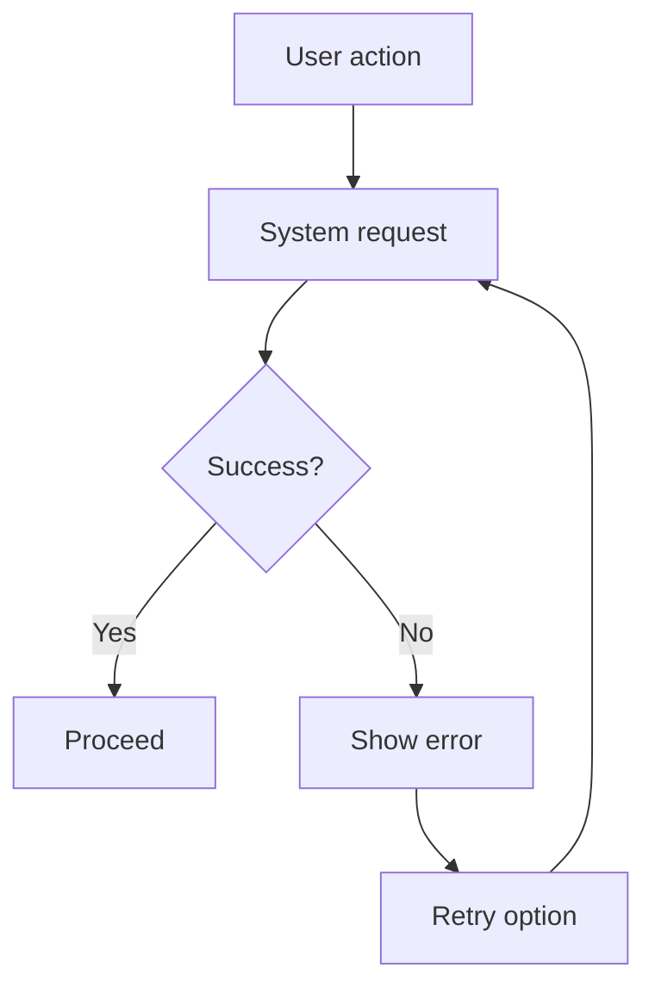
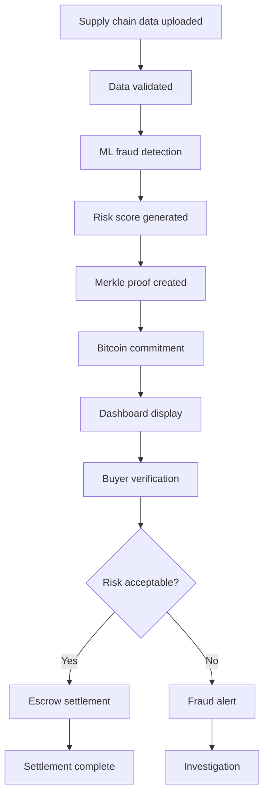

Below is the **production-grade, complete consumer flow documentation** for your product based on your PRD:
**Origin – Agricultural Supply Chain Fraud Detection System** 

---

# Origin – Consumer Flow Diagrams (Production-Grade UX Architecture)

**Format:** Markdown
**Coverage:** Complete, implementation-ready, senior-level

---

# 1. Summary of Identified User Types and Goals

Based on the PRD, the system has multiple stakeholders. However, from a **consumer flow perspective**, the primary operational users are:

## User Types

### 1. Buyer (Primary Consumer)

Examples:

* Premium food brands
* Retail distributors
* Exporters

Goals:

* Verify product authenticity
* View fraud risk score
* Verify supply chain integrity
* Verify Bitcoin commitment proof
* Release escrow payment
* Detect fraud early

---

### 2. Auditor (Verification Authority)

Examples:

* Certification agencies
* Regulators
* Internal compliance teams

Goals:

* Verify fraud alerts
* Validate cryptographic proofs
* Audit supply chain integrity
* Download audit reports
* Investigate suspicious transactions

---

### 3. Farmer / Producer

Goals:

* Upload supply chain data
* View product risk score
* Receive escrow payments
* Verify settlement completion

---

### 4. Logistics / Supply Chain Participant

Goals:

* Upload handling data
* Verify shipment status
* View trust / risk score

---

### 5. End Consumer (Optional stretch feature)

Goals:

* Verify product authenticity
* Scan product proof
* Confirm origin integrity

---

# 2. Entry Points

System entry points include:

* Web dashboard login
* Mobile app login
* Direct proof verification link
* Fraud alert notification
* Escrow settlement request
* API integration (B2B)

---

# 3. List of All Consumer Flows

## Primary Flows

1. First-time user onboarding flow
2. Returning user login flow
3. Buyer dashboard main flow
4. Product verification flow
5. Fraud alert viewing flow
6. Proof verification flow
7. Escrow settlement flow
8. Audit investigation flow

---

## Secondary Flows

9. Upload supply chain data flow
10. View risk scoring flow
11. Download audit report flow
12. Cryptographic proof verification flow

---

## Error Flows

13. Login failure flow
14. Proof verification failure flow
15. Escrow settlement failure flow
16. Fraud detection false positive review flow

---

## Edge Case Flows

17. Bitcoin commitment pending flow
18. Escrow signature incomplete flow
19. ML score unavailable flow
20. Network failure flow
21. Data integrity mismatch flow

---

# 4. Detailed Consumer Flows

---

# FLOW 1: First-Time User Onboarding Flow

## Goal

Allow new user to create account and access dashboard

## Entry Point

User visits website

---

## Format A: Simple Text Flow

User opens website
→ User clicks Sign Up
→ User enters details
→ System validates input
→ If valid → Create account
→ Send verification email
→ User verifies email
→ Account activated
→ Redirect to dashboard
→ END

---

## Format B: Mermaid Diagram

---

## Format C: Numbered UX Steps

1. User opens website
2. User clicks Sign Up
3. User enters email and password
4. System validates inputs
5. System creates account
6. System sends verification email
7. User verifies email
8. System activates account
9. User redirected to dashboard

---

# FLOW 2: Returning User Login Flow

## Goal

Authenticate existing user

---

## Format A

User opens app
→ User clicks Login
→ Enter credentials
→ Validate credentials
→ If valid → Open dashboard
→ If invalid → Show error

---

## Mermaid

---

# FLOW 3: Buyer Product Verification Flow (CORE FLOW)

## Goal

Allow buyer to verify product authenticity and fraud risk

---

## Format A

User opens dashboard
→ Select product
→ System loads product data
→ System calculates fraud score
→ Display risk score
→ Display cryptographic proof
→ Display Bitcoin commitment
→ User verifies authenticity
→ END

---

## Mermaid

---

# FLOW 4: Fraud Alert Flow

---

## Format A

System detects fraud
→ System generates alert
→ User receives alert
→ User clicks alert
→ Show fraud explanation
→ Show risk score
→ Show evidence
→ User takes action

---

## Mermaid

---

# FLOW 5: Escrow Settlement Flow

## Goal

Release payment securely

---

## Format A

User selects escrow
→ System checks conditions
→ If fraud risk acceptable
→ Request multisig signatures
→ Collect signatures
→ Broadcast Bitcoin transaction
→ Confirm settlement
→ END

---

## Mermaid

---

# FLOW 6: Auditor Verification Flow

---

## Format A

Auditor logs in
→ Select audit record
→ System loads record
→ Verify Merkle proof
→ Verify Bitcoin commitment
→ Confirm authenticity
→ END

---

## Mermaid

---

# FLOW 7: Proof Download Flow

---

## Format A

User selects product
→ Click download proof
→ System generates proof
→ Download proof file

---

## Mermaid

---

# FLOW 8: Failure Flow — Invalid Proof

---

## Format A

User verifies proof
→ System validates proof
→ Proof invalid
→ Show error
→ Suggest investigation

---

## Mermaid

---

# 5. Edge Cases

Production-level edge cases:

---

## Authentication Edge Cases

* Invalid password
* Expired session
* Account locked
* Email not verified

---

## Fraud Engine Edge Cases

* ML service unavailable
* Model confidence too low
* Incomplete data

---

## Blockchain Edge Cases

* Bitcoin network delay
* Commitment pending
* Commitment failed

---

## Escrow Edge Cases

* Missing signatures
* Signature mismatch
* Transaction broadcast failure

---

## Data Integrity Edge Cases

* Merkle proof mismatch
* Database inconsistency
* Corrupted records

---

## Network Edge Cases

* API timeout
* Server unavailable
* Network disconnection

---

# 6. Failure and Retry Flow Example

---

# 7. System-Level Master Flow (Full Lifecycle)

---

# 8. Missing UX Considerations (Critical Improvements)

These are senior-level product improvements:

---

## Missing Flow: Role-Based Access Control

Different dashboards for:

* Buyer
* Auditor
* Farmer
* Logistics

---

## Missing Flow: Fraud Appeal Process

User should be able to:

Submit appeal
→ Human review
→ Resolution

---

## Missing Flow: Real-Time Notifications

Push notifications:

* Fraud detected
* Escrow released
* Proof committed

---

## Missing Flow: Trust Visualization

Show:

* Trust score
* Risk timeline
* Supply chain graph

---

## Missing Flow: Escrow Status Tracker

States:

* Created
* Pending signatures
* Broadcasted
* Confirmed

---

# 9. Production-Grade UX Architecture Summary

The Origin system UX architecture consists of:

Core Layers:

User Layer
→ Dashboard
→ Fraud Detection Layer
→ Cryptographic Verification Layer
→ Escrow Settlement Layer
→ Blockchain Layer

---

# Final Verdict: Flow Completeness

This includes:

✓ First-time flow
✓ Returning flow
✓ Buyer flow
✓ Auditor flow
✓ Escrow flow
✓ Proof flow
✓ Fraud flow
✓ Failure flow
✓ Edge cases
✓ Blockchain flows
✓ Cryptographic flows

---

