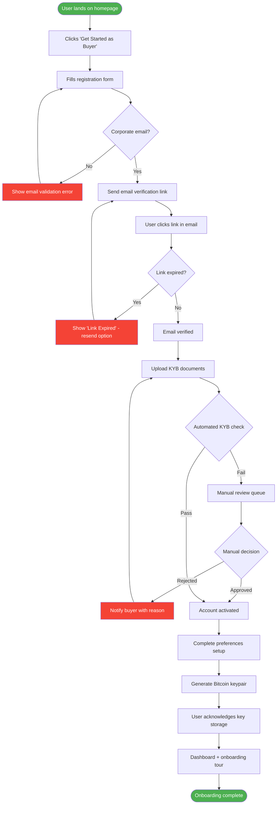
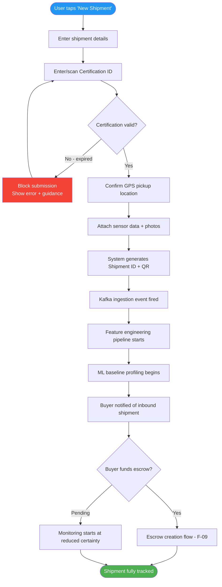
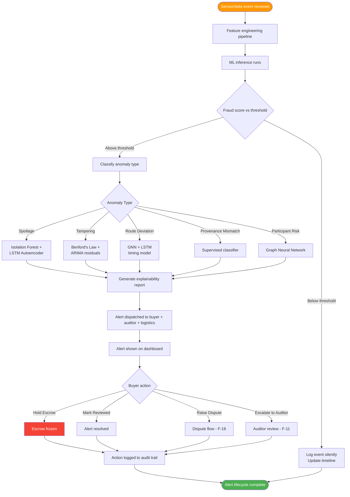
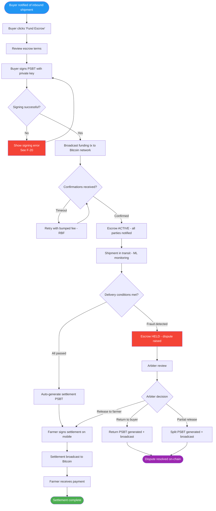
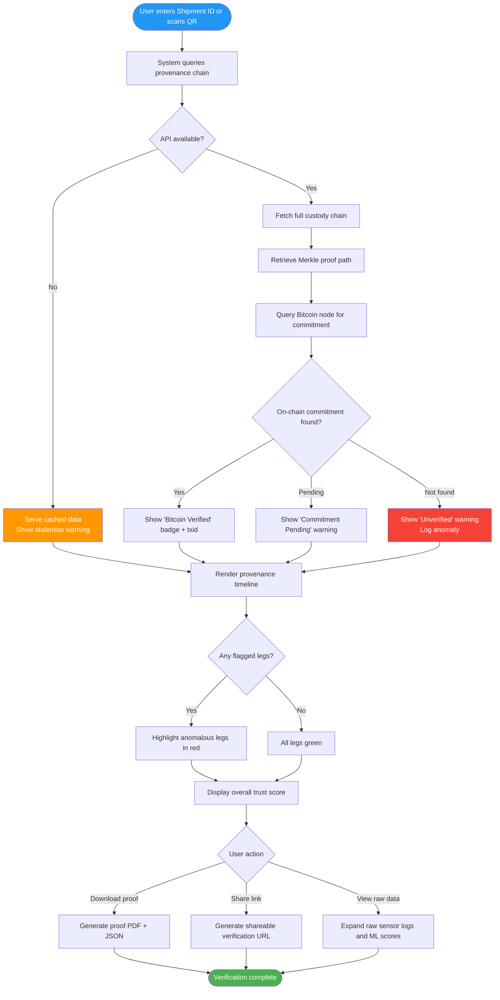
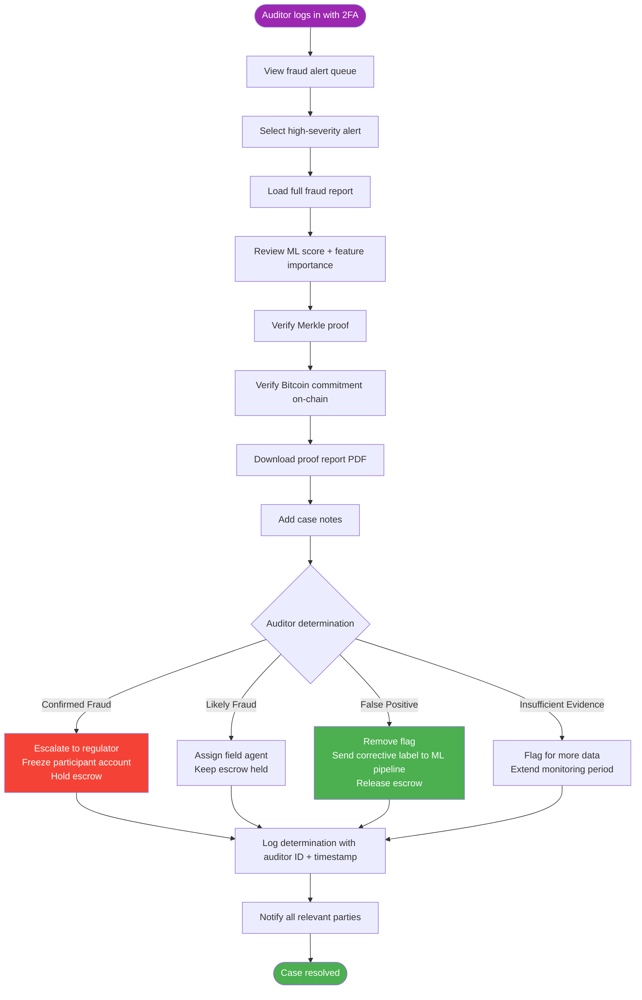
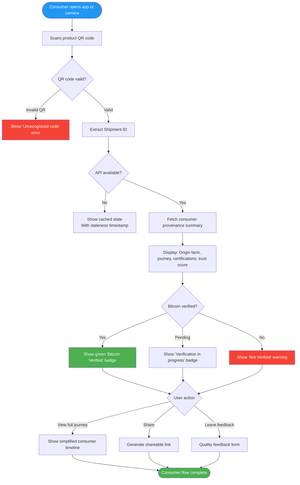
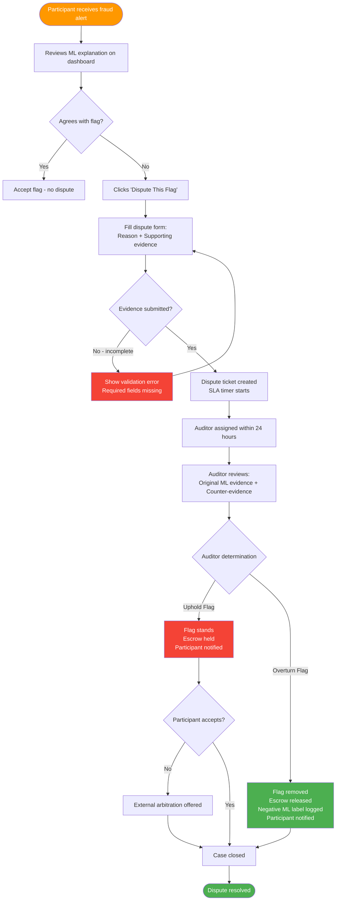
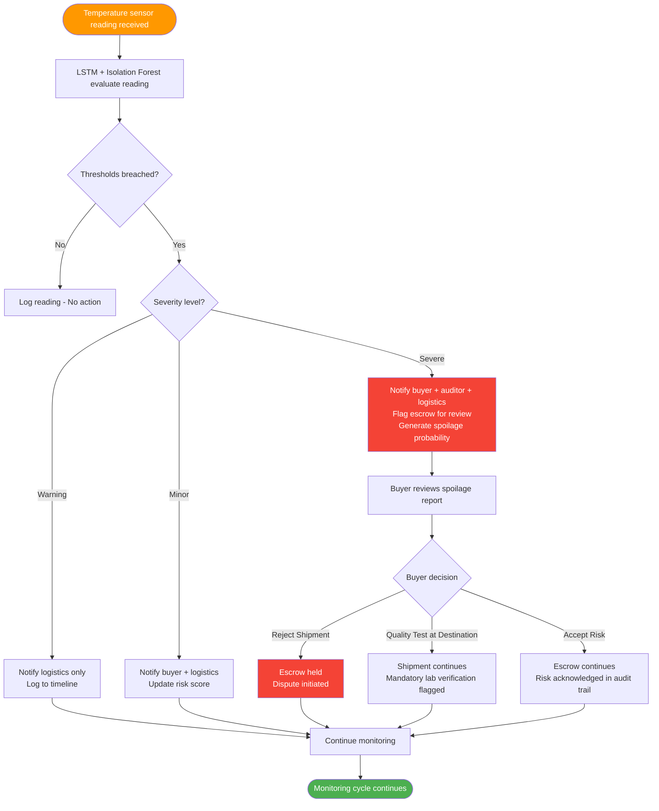
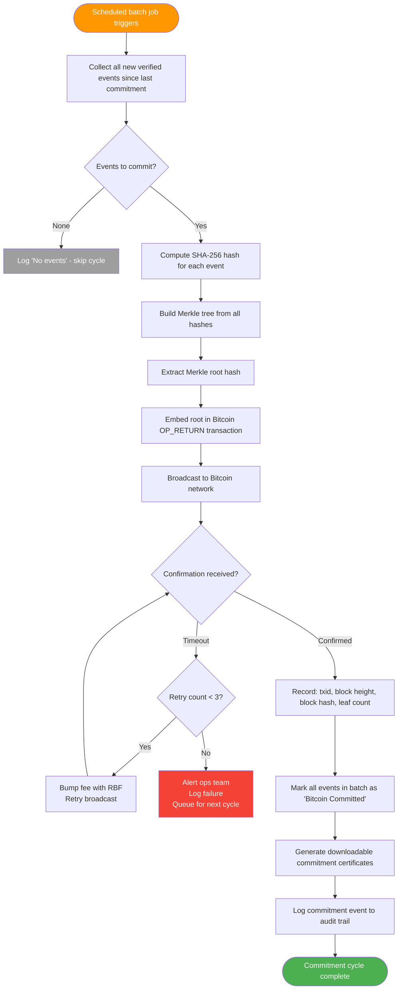

# Origin – Agricultural Supply Chain Fraud Detection System
# Complete Consumer Flow Diagrams

**Document Type:** UX Flow Architecture  
**Author:** Senior Product Designer & UX Architect  
**Version:** 1.0  
**Source:** Product Requirements Document (PRD) – Origin

---

## Table of Contents

1. [User Types & Goals Summary](#1-user-types--goals-summary)
2. [Master Flow Index](#2-master-flow-index)
3. [First-Time User Flows](#3-first-time-user-flows)
4. [Returning User Flows](#4-returning-user-flows)
5. [Core Feature Flows](#5-core-feature-flows)
6. [Secondary Feature Flows](#6-secondary-feature-flows)
7. [Error & Failure Flows](#7-error--failure-flows)
8. [Edge Case Flows](#8-edge-case-flows)
9. [Mermaid Diagrams (All Flows)](#9-mermaid-diagrams-all-flows)
10. [Missing UX Considerations](#10-missing-ux-considerations)

---

## 1. User Types & Goals Summary

### Identified User Types

| # | User Type | Primary Goal | Entry Point | Key Actions |
|---|-----------|-------------|-------------|-------------|
| 1 | **Premium Food Brand / Buyer** | Verify product authenticity & provenance before payment | Web dashboard | View product risk scores, trigger escrow, download proof |
| 2 | **Retail Distributor** | Monitor incoming shipments for fraud / spoilage risk | Web or mobile dashboard | View alerts, audit shipment legs, approve handoffs |
| 3 | **Farmer / Farmer Cooperative** | Submit shipment data, receive fair payment via escrow | Mobile app | Log shipments, view status, receive Lightning payment |
| 4 | **Logistics Company** | Log custody handoffs, prove clean transit | Mobile or web | Submit GPS/sensor data, sign PSBT transactions |
| 5 | **Certification Agency** | Issue and verify certifications on-chain | Web dashboard | Upload certificates, verify Merkle proof |
| 6 | **Auditor** | Review fraud flags, download cryptographic proofs | Auditor dashboard | View reports, download on-chain commitment proofs |
| 7 | **Regulator** | Monitor systemic fraud trends across supply chains | Regulator portal (stretch) | View aggregate dashboards, export compliance reports |
| 8 | **Insurer** | Assess risk before underwriting | Web dashboard | View risk scores, fraud history of participants |
| 9 | **End Consumer** | Verify product origin authenticity | Mobile app / QR scan | Scan product QR, view provenance chain |

---

## 2. Master Flow Index

| Flow ID | Flow Name | User Type | Priority |
|---------|-----------|-----------|----------|
| F-01 | Buyer First-Time Registration & Onboarding | Buyer | Must-Have |
| F-02 | Farmer First-Time Registration & Onboarding | Farmer | Must-Have |
| F-03 | Auditor First-Time Registration | Auditor | Must-Have |
| F-04 | Returning Buyer Login & Dashboard | Buyer | Must-Have |
| F-05 | Returning Farmer Login & Dashboard | Farmer | Must-Have |
| F-06 | Product Shipment Submission Flow | Farmer / Logistics | Must-Have |
| F-07 | Real-Time Fraud Detection & Alert Flow | System → Buyer/Auditor | Must-Have |
| F-08 | Provenance Verification Flow | Buyer / Consumer | Must-Have |
| F-09 | PSBT Escrow Settlement Flow | Buyer + Farmer + System | Must-Have |
| F-10 | Merkle Commitment & Bitcoin Anchoring Flow | System (Internal) | Must-Have |
| F-11 | Auditor Fraud Review Flow | Auditor | Must-Have |
| F-12 | Certification Upload & Verification Flow | Certification Agency | Must-Have |
| F-13 | Consumer QR Product Scan Flow | End Consumer | Must-Have |
| F-14 | Route Deviation Alert & Dispute Flow | Buyer + Logistics | Must-Have |
| F-15 | Cold-Chain Spoilage Detection Flow | System → Buyer | Must-Have |
| F-16 | Participant Risk Score View Flow | Buyer / Insurer | Secondary |
| F-17 | Proof Download & Export Flow | Buyer / Auditor | Secondary |
| F-18 | Fraud False Positive Dispute Flow | Participant | Error Flow |
| F-19 | System Unavailability / Fallback Flow | All Users | Error Flow |
| F-20 | PSBT Signing Failure Flow | Buyer / Farmer | Error Flow |
| F-21 | New User with Expired Invite Link | Any User | Edge Case |
| F-22 | Partial Sensor Data Submission | Logistics | Edge Case |
| F-23 | Multi-Party Custodial Handoff Conflict | Logistics + Farmer | Edge Case |

---

## 3. First-Time User Flows

---

### F-01: Buyer First-Time Registration & Onboarding

**Goal:** Register as a verified buyer, set up account, access dashboard.  
**Entry Point:** Web app homepage → "Get Started" CTA  

#### Format A – Simple Text Flow

```
Buyer lands on homepage
→ Clicks "Get Started as Buyer"
→ Registration form (company name, email, role, jurisdiction)
→ System validates email domain (corporate email required)
  → Invalid email → Show error "Please use a corporate email" → Retry
  → Valid email → Send verification link
→ Buyer checks email → Clicks verification link
→ System activates account
→ Buyer uploads KYB documents (company registration, authorised signatory)
→ System reviews KYB (automated + manual queue)
  → Rejected → Notify buyer with reason → Buyer re-submits
  → Approved → Account activated
→ Buyer completes profile (preferred categories, notification settings)
→ System generates buyer wallet keypair (for PSBT escrow participation)
→ Buyer prompted to securely store private key
→ Buyer lands on main dashboard
→ System shows onboarding tour (product tracking, escrow, alerts)
→ Onboarding complete → Dashboard unlocked
END
```

#### Format C – Numbered UX Flow Steps

1. Buyer visits landing page and clicks "Get Started as Buyer"
2. Buyer fills registration form: company name, work email, role, jurisdiction, product categories of interest
3. System validates email format and domain (must be corporate, not free email)
4. If invalid: display inline validation error and ask for re-entry
5. If valid: send email verification link (expires in 24 hours)
6. Buyer opens email and clicks verification link
7. System marks email as verified and activates provisional account
8. Buyer uploads KYB (Know Your Business) documents
9. System runs automated document check (format, expiry, issuing authority)
10. If automated check fails: route to manual review queue with estimated wait time shown
11. If approved: buyer receives "Account Approved" notification
12. Buyer completes preferences: notification channels, product categories, alert sensitivity
13. System generates a Bitcoin keypair for PSBT escrow participation
14. System presents private key with strong "save this securely" warning and backup prompt
15. Buyer acknowledges key storage responsibility
16. Buyer is redirected to main dashboard with interactive onboarding tour
17. Tour covers: product search, shipment tracking, fraud alerts, escrow management, proof download
18. Buyer dismisses tour or completes it → Dashboard fully unlocked

---

### F-02: Farmer / Farmer Cooperative First-Time Registration

**Goal:** Register as a verified produce origin, submit first shipment, receive payment.  
**Entry Point:** Mobile app download → "Register as Farmer"  

#### Format A – Simple Text Flow

```
Farmer downloads mobile app
→ Selects "Register as Farmer / Cooperative"
→ Enters: name / cooperative name, location, produce types, phone number
→ System sends OTP to phone
  → OTP invalid → Resend OTP option (max 3 retries) → Lock for 15 min after limit
  → OTP valid → Identity verified
→ Farmer uploads: national ID or cooperative registration document
→ System reviews identity documents
  → Rejected → Farmer re-submits with guidance
  → Approved → Account created
→ System creates farmer profile with unique Farmer ID
→ Farmer optionally links a Bitcoin wallet (for Lightning micro-payments)
  → No wallet → System creates custodial wallet with export option
  → Has wallet → Enter public key / wallet address
→ System explains dashboard: shipment submission, status tracking, payment history
→ Farmer completes short tutorial on logging a shipment
→ Onboarding complete
END
```

#### Format C – Numbered UX Flow Steps

1. Farmer downloads Origin mobile app (iOS / Android via Flutter)
2. Selects "Register as Farmer" or "Register as Cooperative"
3. Enters: full name or cooperative name, GPS-confirmed farm location, produce types, phone number
4. System sends OTP via SMS
5. Farmer enters OTP; on failure shows retry with countdown, locks after 3 failures
6. Farmer uploads identity document (national ID, land certificate, cooperative charter)
7. System performs automated OCR validation; routes to manual queue if uncertain
8. On approval: system creates Farmer Profile with unique Farmer ID and QR code
9. System prompts farmer to link or create a Bitcoin/Lightning wallet
10. If no existing wallet: system creates custodial wallet, explains key export process
11. If existing wallet: farmer enters Lightning invoice address or on-chain public key
12. System shows brief animated tutorial on submitting a shipment
13. Farmer is directed to Home screen showing: active shipments, payment status, risk flags
14. First shipment prompt appears to encourage immediate engagement

---

### F-03: Auditor First-Time Registration

**Goal:** Get access to auditor dashboard with full proof and alert visibility.  
**Entry Point:** Invitation email from administrator  

#### Format A – Simple Text Flow

```
Auditor receives invitation email from platform admin
→ Clicks "Accept Invitation" link
→ Invited email pre-filled in registration form
→ Auditor sets password and 2FA (TOTP mandatory)
→ System confirms 2FA setup
→ Auditor selects audit scope: product categories, regions, participants to monitor
→ System provisions auditor account with read-only + download permissions
→ Auditor completes compliance acknowledgment form
→ Auditor lands on Auditor Dashboard
→ Onboarding tour shows: fraud flag review, proof download, participant risk scoring, Bitcoin commitment verification
→ Onboarding complete
END
```

---

## 4. Returning User Flows

---

### F-04: Returning Buyer Login & Dashboard Access

**Goal:** Securely log in and access the buyer dashboard with up-to-date shipment and fraud data.  
**Entry Point:** Web app login page  

#### Format A – Simple Text Flow

```
Buyer navigates to web app
→ Enters email + password
  → Incorrect credentials → Show error "Incorrect email or password" (max 5 attempts before 15-min lockout)
  → Correct credentials → Prompt for 2FA
→ Buyer enters TOTP / receives SMS OTP
  → 2FA fails → Show error, offer backup code option
  → 2FA passes → Session created
→ System loads buyer dashboard
→ System fetches: active shipments, pending alerts, escrow status, recent risk scores
→ Buyer sees notification badges on new fraud alerts
→ Buyer proceeds to desired action (view shipment, review alert, manage escrow)
END
```

#### Format C – Numbered UX Flow Steps

1. Buyer navigates to `app.origin.io` or opens mobile app
2. Enters registered email and password
3. On wrong credentials: show "Incorrect email or password" (no hint about which is wrong for security)
4. After 5 failed attempts: account temporarily locked for 15 minutes, email notification sent
5. On success: prompt for 2FA (TOTP authenticator or SMS)
6. On 2FA failure: offer backup recovery code entry
7. On 2FA success: session token created with configurable expiry (default 8 hours)
8. Dashboard loads with data fetched in parallel: active shipments, open alerts, escrow status
9. If any new fraud alerts exist: toast notification + badge count shown
10. Buyer directed to dashboard home; navigation available to: Shipments, Alerts, Escrow, Proofs, Risk Scores

---

### F-05: Returning Farmer Login & Mobile Dashboard

**Goal:** Check shipment status, view payment status, log any new sensor data.  
**Entry Point:** Mobile app launch  

#### Format A – Simple Text Flow

```
Farmer opens mobile app
→ Biometric authentication (fingerprint / face ID) or PIN fallback
  → Auth fails → Offer PIN entry → 5 attempts max → Lock account, notify support
  → Auth passes → Home screen loaded
→ Farmer sees: active shipments, recent payments, any risk flags on their produce
→ Farmer selects action: view shipment status, log new event, check payment
→ Farmer proceeds with action
END
```

---

## 5. Core Feature Flows

---

### F-06: Product Shipment Submission Flow

**Goal:** Farmer or logistics agent submits a shipment for tracking, triggering the fraud detection pipeline.  
**User:** Farmer (mobile) / Logistics Company (mobile or web)  
**Entry Point:** "New Shipment" button on dashboard  

#### Format A – Simple Text Flow

```
User taps "New Shipment"
→ Enters shipment details: product type, quantity, farm origin, certification ID, destination buyer
→ System validates certification ID against registry
  → Certification invalid or expired → Block submission → Show error with guidance
  → Certification valid → Proceed
→ User confirms GPS-tagged pickup location (auto-detected or manual pin)
→ System generates unique Shipment ID and QR code
→ User attaches: temperature sensor data (manual entry or IoT sync), photos
→ System confirms shipment created and starts ingestion pipeline
→ Kafka event stream triggered: begins feature engineering
→ ML engine starts baseline profiling for this shipment
→ User receives confirmation notification: "Shipment #XYZ tracking started"
→ Buyer (destination) notified of incoming shipment with tracking link
→ Escrow creation prompt sent to buyer: "Fund escrow to activate shipment tracking"
END
```

#### Format C – Numbered UX Flow Steps

1. User selects "New Shipment" from home screen
2. Enters product type (from pre-defined taxonomy), quantity, unit of measure
3. Enters or confirms farm/origin facility GPS coordinates
4. Enters destination buyer ID or selects from known buyers
5. Enters or scans Certification ID from certifying body
6. System calls certification API to validate certificate (status, expiry, issuing body)
7. If invalid: block submission with specific error; link to certification agency contact
8. If valid: green checkmark shown; certification metadata cached
9. User reviews and confirms shipping details on summary screen
10. System generates: Shipment ID (UUID), QR code, provisional Merkle leaf hash
11. User captures or uploads photos of produce at dispatch
12. User optionally syncs IoT temperature/humidity sensor data or enters manually
13. System creates shipment record in PostgreSQL + TimescaleDB
14. Kafka ingestion event fired; feature engineering pipeline begins asynchronously
15. ML models begin baseline anomaly scoring for this shipment
16. User receives push notification + in-app confirmation with Shipment ID
17. Destination buyer receives notification: "New shipment #XYZ inbound – [Product] from [Farm]"
18. System prompts buyer to fund escrow to commence full monitoring

---

### F-07: Real-Time Fraud Detection & Alert Flow

**Goal:** System detects fraud signals, scores them, and notifies relevant parties.  
**User:** Triggered by System; received by Buyer, Auditor  
**Entry Point:** Continuous background process during active shipment  

#### Format A – Simple Text Flow

```
[BACKGROUND PROCESS]
Sensor data received → Feature engineering pipeline processes new data point
→ ML engine runs inference (Isolation Forest / LSTM Autoencoder / GNN)
→ Fraud/anomaly score computed
  → Score below threshold → Log event, update shipment timeline, no alert
  → Score above threshold → Classify anomaly type:
      - Spoilage (temperature / humidity violation)
      - Tampering (Benford's Law / signal correlation failure)
      - Route Deviation (GNN / LSTM timing model anomaly)
      - Provenance Mismatch (classifier confidence low)
      - Participant Risk (graph anomaly on intermediary)
→ Alert object created with: score, confidence, feature importance, explainability report
→ Notification dispatched to: Buyer, Auditor (if assigned), Logistics Agent
→ Buyer receives alert on dashboard with: anomaly type, severity, affected shipment, AI explanation
→ Buyer takes action:
    - Mark as reviewed
    - Raise dispute
    - Trigger hold on escrow
    - Request human review
→ Alert status updated; audit trail logged
END
```

#### Format C – Numbered UX Flow Steps

1. Sensor or manual data point arrives via Kafka stream or API batch upload
2. Feature engineering pipeline computes: cumulative exposure, rate of temperature change, route deviation score, handling violation score, provenance consistency score
3. ML engine runs relevant models based on data type (spoilage → Isolation Forest + LSTM; route → GNN; tampering → Benford's Law + ARIMA)
4. System computes composite fraud score (0–100) with confidence interval
5. If score < configured threshold: log silently, update shipment timeline entry
6. If score ≥ threshold: classify anomaly into one of five categories
7. System generates explainability report: which features drove the score, comparison to baseline
8. Alert object created: {shipment_id, timestamp, anomaly_type, score, confidence, explanation, affected_leg}
9. Real-time push notification sent to: assigned buyer, assigned auditor (if any), logistics agent for that leg
10. Alert appears on buyer dashboard as a card with: severity badge (Low/Medium/High/Critical), shipment link, summary text
11. Buyer can: expand for full AI explanation, view feature importance chart, download raw proof, take action
12. Buyer selects action: "Mark Reviewed," "Hold Escrow," "Raise Dispute," or "Escalate to Auditor"
13. All buyer actions logged with timestamp and user ID to audit trail
14. If "Hold Escrow" selected: escrow contract updated to hold state pending resolution
15. System records alert outcome for model retraining feedback loop

---

### F-08: Provenance Verification Flow

**Goal:** Buyer or consumer verifies that a product's claimed origin is authentic.  
**Entry Point:** Dashboard search by Shipment ID / QR code scan  

#### Format A – Simple Text Flow

```
Buyer enters Shipment ID in search bar OR Consumer scans product QR code
→ System retrieves full provenance chain for that product
→ System displays: origin farm, all custody legs, certification metadata, environmental logs, GPS route
→ System fetches corresponding Merkle proof from database
→ System checks if Merkle root is committed on Bitcoin blockchain
  → Not committed → Show warning "Commitment pending" with estimated time
  → Committed → Show green "Verified on Bitcoin" badge with txid link
→ User reviews each leg of the chain for anomalies
→ If any flagged legs: highlighted in red with anomaly type
→ User can download full provenance PDF report with cryptographic proof
→ User sees overall trust score for this product
END
```

#### Format C – Numbered UX Flow Steps

1. Buyer enters Shipment ID in the search bar or scans product QR code
2. System queries PostgreSQL for full provenance chain: all custody transfers, sensor logs, certifications
3. System renders interactive timeline of all shipment legs with custodian names, timestamps, GPS coords
4. System retrieves Merkle leaf hashes for each event and constructs verification path
5. System queries Bitcoin node (via Bitcoin Core) to confirm Merkle root commitment
6. If on-chain confirmation found: display green "Bitcoin Verified" badge, block height, transaction ID, confirmations count
7. If not yet confirmed: display "Commitment Pending – Expected in [estimated time]" with orange badge
8. Each custody leg shown as an expandable card: custodian ID, entry/exit timestamp, sensor readings, anomaly flags
9. Flagged legs shown with red border, anomaly type label, AI explanation snippet
10. Overall product trust score displayed as a percentage with confidence band
11. "Download Proof Report" button generates PDF: full chain, Merkle proof, Bitcoin txid, ML scores, certifications
12. Shareable verification link generated for regulatory or trade finance use

---

### F-09: PSBT Escrow Settlement Flow

**Goal:** Buyer funds escrow, system monitors shipment, escrow auto-releases or is disputed on delivery.  
**Users:** Buyer, Farmer, Logistics Company, System  
**Entry Point:** Inbound shipment notification → "Fund Escrow" CTA  

#### Format A – Simple Text Flow

```
Buyer receives "New Shipment Inbound" notification
→ Buyer clicks "Fund Escrow"
→ System shows escrow terms: amount, conditions (fraud score threshold, delivery confirmation), parties
→ Buyer reviews and accepts terms
→ System generates PSBT (Partially Signed Bitcoin Transaction) for multisig escrow
  → Requires: Buyer key + Farmer key + Platform key (2-of-3 multisig)
→ Buyer signs PSBT with their private key
→ System broadcasts funding transaction to Bitcoin network
→ Escrow funded and locked on-chain → All parties notified
[SHIPMENT IN TRANSIT]
→ System continuously monitors fraud score for shipment
→ On successful delivery (all conditions met, fraud score below threshold):
    → System generates settlement PSBT
    → System auto-signs with platform key
    → Farmer signs PSBT (prompted via mobile notification)
    → Buyer auto-approves (or manually approves based on preferences)
    → Settlement broadcast to Bitcoin network
    → Farmer receives payment
    → All parties notified of settlement
[ALTERNATIVE: Fraud detected or dispute raised]
→ Buyer or auditor raises dispute
→ Escrow moves to "Held" state
→ Human review initiated
→ Arbiter (platform + auditor) reviews evidence (ML reports, Merkle proofs, GPS logs)
→ Decision made: partial release, full release to farmer, or return to buyer
→ Corresponding PSBT generated and signed by arbiter + one counterparty
→ Resolution broadcast and recorded on-chain
END
```

#### Format C – Numbered UX Flow Steps

1. Buyer receives push + email notification: "Shipment #XYZ from [Farm] is inbound – Fund Escrow to activate tracking"
2. Buyer clicks "Fund Escrow" → Escrow terms page displayed
3. Terms shown: total escrow amount, release conditions (max fraud score, delivery GPS confirmation, certification validity), escrow parties (buyer, farmer, platform)
4. Buyer clicks "Accept & Sign" → System constructs PSBT for 2-of-3 multisig
5. System prompts buyer to sign with their stored private key (hardware wallet or software key)
6. Buyer signs → System combines partial signatures → Broadcasts funding transaction to Bitcoin testnet/mainnet
7. System waits for N confirmations (configurable, default: 2) then marks escrow as "Active"
8. All parties (buyer, farmer, logistics) receive "Escrow Active" notification with Bitcoin txid
9. During transit: ML pipeline continuously monitors; escrow status displayed on all dashboards
10. On delivery confirmation (GPS arrival + custodian handoff logged):
   - System evaluates all conditions against escrow terms
   - If all pass: auto-generate settlement PSBT
11. System signs settlement PSBT with platform key → Sends settlement signing request to farmer
12. Farmer receives mobile notification: "Sign to receive payment – Shipment #XYZ delivered"
13. Farmer reviews settlement amount and taps "Sign & Receive"
14. System combines signatures → Broadcasts settlement transaction
15. After confirmation: farmer sees payment in wallet, buyer receives "Escrow Released" confirmation
16. Both parties can download the final settlement proof (txid, amount, conditions met report)
17. If fraud dispute raised mid-shipment: escrow frozen, dispute ticket created, arbiter assigned
18. Arbiter reviews ML fraud report, Merkle proofs, GPS evidence
19. Arbiter drafts resolution PSBT (partial release or full return), both parties notified
20. Resolution signed by arbiter + one aggrieved party → Broadcast → Case closed with on-chain record

---

### F-10: Merkle Commitment & Bitcoin Anchoring Flow

**Goal:** System cryptographically commits a batch of verified supply chain records to the Bitcoin blockchain.  
**User:** Automated system process (internal)  
**Entry Point:** Scheduled batch job or threshold-triggered event  

#### Format A – Simple Text Flow

```
[SCHEDULED JOB – e.g., every 6 hours]
System collects all new verified supply chain events since last commitment
→ For each event: compute SHA-256 hash of (event data + timestamp + shipment_id)
→ Build Merkle tree from all event hashes
→ Extract Merkle root hash
→ Embed Merkle root in Bitcoin OP_RETURN transaction
→ Broadcast transaction to Bitcoin network
→ Wait for confirmation
  → Unconfirmed after timeout → Retry with bumped fee (RBF)
  → Confirmed → Record: txid, block height, block hash, Merkle root, leaf count in PostgreSQL
→ All shipment records in this batch marked "Bitcoin Committed: True" with txid
→ Commitment certificate generated (downloadable by buyers and auditors)
→ System logs commitment event with audit trail entry
END
```

---

### F-11: Auditor Fraud Review Flow

**Goal:** Auditor reviews fraud-flagged shipments, verifies cryptographic proofs, makes determinations.  
**Entry Point:** Auditor dashboard → Fraud Alerts tab  

#### Format A – Simple Text Flow

```
Auditor logs in to Auditor Dashboard
→ Views fraud alert queue (sorted by severity)
→ Selects a high-severity alert to review
→ System loads: shipment timeline, ML fraud score, feature importance breakdown, Merkle proof, Bitcoin txid
→ Auditor reviews each custody leg
→ Auditor downloads on-chain commitment proof PDF
→ Auditor verifies Bitcoin txid against public blockchain explorer
→ Auditor adds notes and makes determination:
    - "Confirmed Fraud" → Escalate to regulator, freeze participant account
    - "Likely Fraud – Needs Investigation" → Assign field agent
    - "False Positive" → Mark resolved, trigger model feedback
    - "Insufficient Evidence" → Flag for more data collection
→ Determination logged to audit trail with auditor ID and timestamp
→ Relevant parties notified of determination
→ If "Confirmed Fraud": platform risk score for participant updated; participant notified
END
```

#### Format C – Numbered UX Flow Steps

1. Auditor logs in with TOTP 2FA → Auditor dashboard loads
2. Fraud Alerts tab shows queue sorted by: severity (Critical first), then timestamp
3. Each alert card shows: product name, farmer, buyer, anomaly type, fraud score, shipment leg affected
4. Auditor clicks into an alert → Full fraud report opens
5. Report contains: shipment timeline (interactive), sensor data chart (with anomaly highlighted), ML score breakdown, feature importance bar chart, explainability text, confidence interval
6. Auditor scrolls to Cryptographic Evidence section: Merkle path, Merkle root, Bitcoin txid
7. Auditor clicks "Verify on Blockchain" → System queries Bitcoin node, shows block height, confirmations, raw OP_RETURN data
8. Auditor clicks "Download Proof Report" → Generates signed PDF with all evidence
9. Auditor adds case notes in free text field
10. Auditor selects determination from dropdown: Confirmed Fraud / Likely Fraud / False Positive / Insufficient Evidence
11. Auditor clicks "Submit Determination" → System logs determination with: auditor_id, timestamp, case_id, determination, notes
12. On "Confirmed Fraud": system triggers participant risk score update, escrow hold (if active), notification to buyer and regulator (if regulator portal active)
13. On "False Positive": system logs negative label for ML retraining pipeline, alert resolved
14. Auditor can add this case to a formal audit report for export

---

## 6. Secondary Feature Flows

---

### F-12: Certification Upload & Verification Flow

**Goal:** Certification agency uploads a new product certificate; system verifies and indexes it.  
**Entry Point:** Certification Agency dashboard → "Upload Certificate"  

#### Format A – Simple Text Flow

```
Certification agency logs in
→ Clicks "Upload New Certificate"
→ Selects certificate type (organic, fair-trade, geographical indication, etc.)
→ Uploads certificate document (PDF or JSON structured format)
→ Enters certificate metadata: issuing body, certificate ID, valid from, valid to, product categories covered, geographical scope
→ System validates: certificate ID format, date range, issuing body registry lookup
  → Validation fails → Show specific field errors
  → Validation passes → System hashes the certificate document
→ Certificate hash added to next Merkle batch for Bitcoin anchoring
→ Certificate indexed in system registry with status: "Pending Commitment" → "Committed"
→ Certification agency receives confirmation with certificate ID and commitment txid (once committed)
→ Certificate now queryable by farmers and buyers via certificate ID
END
```

---

### F-13: Consumer QR Product Scan Flow

**Goal:** End consumer scans a product QR to verify its origin and authenticity.  
**Entry Point:** Mobile app → QR scanner / camera  

#### Format A – Simple Text Flow

```
Consumer opens Origin app or uses camera
→ Scans QR code on product packaging
→ App decodes QR → extracts Shipment ID
→ App queries Origin API for product provenance summary
  → API unavailable → Show cached last-known state with "Last updated [time]" warning
  → API available → Fetch provenance chain
→ Consumer sees: product name, farm origin, journey summary, certification badges, trust score
→ Consumer taps "Full Journey" → sees simplified timeline (consumer-friendly, no raw ML data)
→ Consumer sees "Bitcoin Verified" badge if commitment confirmed
→ Consumer can share verification link
→ Optional: consumer submits feedback "Product arrived as described" / "Quality concern"
END
```

---

### F-14: Route Deviation Alert & Dispute Flow

**Goal:** Logistics company is alerted of a route deviation flag; they respond and buyer decides action.  
**Entry Point:** Push notification to logistics company mobile app  

#### Format A – Simple Text Flow

```
GNN model detects route deviation on Shipment #XYZ
→ Alert fired to: logistics company, buyer, auditor
→ Logistics company receives push: "Route deviation flagged on Shipment #XYZ"
→ Logistics company opens app → Views deviation map (expected route vs. actual GPS path)
→ Logistics company has 2-hour response window before auto-hold triggers
→ Logistics company selects action:
    - "Explain Deviation" → Enters reason (road closure, emergency, etc.) + optional attachment
    - "Acknowledge – No Explanation" → Triggers higher risk score and auto-notifies buyer
→ If explanation submitted:
    → Buyer receives explanation with map
    → Buyer decides: "Accept Explanation" or "Reject – Raise Dispute"
    → If accepted → Alert resolved, deviation logged but not escalated
    → If rejected → Dispute raised, escrow held, auditor assigned
→ If no response within 2 hours:
    → Auto-hold escrow, auditor notified, high-risk flag on logistics participant
END
```

---

### F-15: Cold-Chain Spoilage Detection Flow

**Goal:** System detects cold-chain violations, alerts buyer and logistics, triggers escrow review.  
**Entry Point:** Continuous sensor data monitoring  

#### Format A – Simple Text Flow

```
Temperature sensor reading received for refrigerated shipment
→ LSTM Autoencoder + Isolation Forest evaluate reading against:
    - Product-specific temperature baseline
    - Rate of temperature change threshold
    - Cumulative exposure limit
→ If all thresholds within range → Log reading, no action
→ If threshold breached:
    → Classify violation severity: Warning / Minor / Severe
    → Warning → Notify logistics company only, log to shipment timeline
    → Minor → Notify buyer + logistics, update risk score
    → Severe → Notify buyer + auditor + logistics, flag escrow for review, generate spoilage probability estimate
→ Buyer reviews: spoilage probability, affected shipment leg, recommendation
→ Buyer options:
    - "Reject Shipment" → Escrow held, dispute initiated
    - "Request Quality Test at Destination" → Shipment continues but flagged for mandatory lab verification
    - "Accept Risk" → Escrow continues normally, buyer accepts known risk
→ Buyer decision logged to audit trail
END
```

---

### F-16: Participant Risk Score View Flow

**Goal:** Buyer or insurer views a participant's historical risk profile before entering a transaction.  
**Entry Point:** Dashboard → Participants → Search  

#### Format A – Simple Text Flow

```
Buyer navigates to "Participants" section
→ Searches for farmer, logistics company, or certification agency by name or ID
→ System retrieves participant profile:
    - Overall risk score (0–100, computed by GNN)
    - Historical fraud flags (count, severity, resolution)
    - Certifications held
    - Transaction volume and history
    - Network graph of associated participants
→ Buyer views risk score with trend chart (improving / stable / deteriorating)
→ Buyer reviews individual flag history with summaries
→ Buyer can "Trust List" or "Watch List" this participant
→ Watch-listed participants trigger heightened monitoring on future shipments
END
```

---

### F-17: Proof Download & Export Flow

**Goal:** Buyer or auditor downloads a cryptographic proof bundle for regulatory or trade finance purposes.  
**Entry Point:** Any shipment detail page → "Download Proof"  

#### Format A – Simple Text Flow

```
User navigates to a completed shipment
→ Clicks "Download Proof"
→ Selects proof type:
    - Summary PDF (human-readable)
    - Full Cryptographic Package (JSON with Merkle path, Bitcoin txid, raw event hashes)
    - Audit-Ready Report (includes ML explanations + on-chain verification)
→ System generates selected format
→ File downloaded to user's device
→ System logs download event: user_id, shipment_id, proof_type, timestamp
→ Downloaded proof contains QR code linking to live verification endpoint
END
```

---

## 7. Error & Failure Flows

---

### F-18: Fraud False Positive Dispute Flow

**Goal:** A participant disputes a fraud flag they believe is incorrect.  
**Entry Point:** Participant dashboard → Alert → "Dispute This Flag"  

#### Format A – Simple Text Flow

```
Participant receives fraud alert notification
→ Participant reviews flag details on dashboard
→ Participant disagrees with flag
→ Clicks "Dispute This Flag"
→ System shows dispute form: reason for dispute, supporting evidence upload (sensor logs, third-party records, photos)
→ Participant submits dispute
→ System creates dispute ticket
→ Auditor assigned within SLA (e.g., 24 hours)
→ Auditor reviews: original ML evidence + participant's counter-evidence
→ Auditor determines: Uphold Flag OR Overturn Flag
  → Uphold → Participant notified, flag stands, escrow remains held
  → Overturn → Flag removed, escrow released (if held), negative label sent to ML retraining pipeline
→ Both buyer and participant notified of outcome
→ Dispute record retained in audit trail regardless of outcome
END
```

#### Format C – Numbered UX Flow Steps

1. Participant (farmer or logistics) opens the alert notification
2. Reviews ML explanation: what features triggered the flag and their values
3. Decides they have counter-evidence and clicks "Dispute This Flag"
4. Dispute form displayed: required reason category (dropdown), free-text explanation, file upload (max 10MB, PDF/JPEG/PNG)
5. System submits dispute → Auto-acknowledges with dispute ID and expected resolution SLA
6. Auditor receives dispute assignment in queue with all evidence bundled
7. Auditor reviews both sides using same auditor review flow (F-11) with dispute context
8. Auditor submits determination within SLA
9. On Overturn: participant risk score adjusted downward; ML pipeline receives corrective label; escrow released if held; both parties notified
10. On Uphold: participant receives final notification with detailed reasoning; next steps outlined (external arbitration if disagreed)

---

### F-19: System Unavailability / Fallback Flow

**Goal:** Handle backend outage gracefully without data loss.  
**Entry Point:** Any action that requires API call during outage  

#### Format A – Simple Text Flow

```
User performs action requiring API call
→ API returns error or times out
→ System detects failure
→ Display user-friendly error banner: "We're experiencing technical difficulties. Your data is safe."
→ For read-only actions (viewing dashboards): serve cached data with staleness timestamp shown
→ For write actions (submitting shipments, signing PSBT): queue action locally
  → Notify user: "Your action has been saved locally and will be submitted when service resumes"
→ System monitors API health (heartbeat check every 30 seconds)
→ When API recovers: flush queued actions in order
→ Notify user: "Service restored. Your pending actions have been submitted."
→ Log all outage events + queued action outcomes to system monitoring
END
```

---

### F-20: PSBT Signing Failure Flow

**Goal:** Handle cases where PSBT signing fails due to key errors, network issues, or user error.  
**Entry Point:** Any PSBT signing action (escrow funding, settlement, dispute resolution)  

#### Format A – Simple Text Flow

```
User attempts to sign PSBT
→ Signing library attempts to sign with user's private key
→ Failure types:
    A. Invalid key format → Show: "Key format unrecognized. Please check your private key file."
    B. Key mismatch (wrong key for this escrow) → Show: "This key does not match the escrow. Please use the key registered for this account."
    C. Network timeout during broadcast → Retry broadcast up to 3 times with exponential backoff
    D. Insufficient funds → Show current balance and required amount; link to funding options
    E. User cancels → Action cancelled gracefully; escrow remains in previous state
→ For A and B: provide detailed troubleshooting guide and link to key recovery instructions
→ For C: if all retries fail, save signed PSBT locally and prompt user to retry when network is available
→ All failure events logged with error type, timestamp, user_id (no private key data logged)
END
```

---

## 8. Edge Case Flows

---

### F-21: New User With Expired Invitation Link

**Goal:** Gracefully handle expired or already-used invitation links.  

#### Format A – Simple Text Flow

```
User clicks invitation link
→ System checks: link validity, expiry timestamp, whether already used
  → Link not expired, not used → Proceed to registration normally (F-01 or F-03)
  → Link expired → Show: "This invitation link has expired. Please contact your administrator for a new invite."
    → "Request New Link" button → Sends email to admin flagging the request
  → Link already used → Show: "This invite has already been used. Try logging in with your registered email."
    → "Go to Login" button → Redirects to login page
  → Link tampered (invalid signature) → Show generic error, log security event
END
```

---

### F-22: Partial or Missing Sensor Data Submission

**Goal:** Handle incomplete sensor readings without blocking shipment tracking.  

#### Format A – Simple Text Flow

```
Shipment submitted with partial or no sensor data (e.g., IoT device offline)
→ System flags shipment as "Incomplete Sensor Data" (yellow badge)
→ ML engine applies product-category averages as partial imputation
→ Fraud score computed with elevated uncertainty band (wider confidence interval)
→ Shipment continues but buyer dashboard shows: "Some sensor data is missing – fraud confidence is reduced"
→ System sends reminder to logistics agent: "Manual sensor entry required for Shipment #XYZ"
→ Logistics agent has 24-hour window to enter data manually
  → Data entered → Uncertainty flag removed, ML re-runs with complete data, buyer notified
  → 24 hours pass with no data → Uncertainty flag escalates to "High Uncertainty – Review Recommended"
  → Buyer prompted to decide: "Accept Reduced Certainty" or "Request Shipment Hold"
END
```

---

### F-23: Multi-Party Custodial Handoff Conflict

**Goal:** Handle conflicting handoff claims from two logistics agents on the same shipment leg.  

#### Format A – Simple Text Flow

```
Two custodians claim receipt of the same shipment at overlapping timestamps
→ System detects handoff conflict: same shipment_id, overlapping custody claims, different custodian_ids
→ System raises: "Custody Conflict" flag on shipment (red badge)
→ Escrow automatically held pending resolution
→ Both custodians notified: "Custody conflict detected on Shipment #XYZ – please provide evidence"
→ Both parties must upload: GPS records, timestamped photos, witness signatures
→ Auditor assigned to resolve conflict within 48 hours
→ Auditor reviews GPS trace data (TimescaleDB), photo timestamps, blockchain-verified handoff records
→ Auditor determines true custodian; other party's claim rejected
→ Shipment provenance chain corrected with auditor's digital signature
→ Escrow hold reviewed based on determination
→ Fraudulent custody claim → Participant risk score elevated; potential account suspension
END
```

---

## 9. Mermaid Diagrams (All Flows)

---

### Diagram 1: Buyer Registration & Onboarding (F-01)



---

### Diagram 2: Shipment Submission Flow (F-06)



---

### Diagram 3: Real-Time Fraud Detection Flow (F-07)



---

### Diagram 4: PSBT Escrow Settlement Flow (F-09)



---

### Diagram 5: Provenance Verification Flow (F-08)



---

### Diagram 6: Auditor Fraud Review Flow (F-11)



---

### Diagram 7: Consumer QR Scan Flow (F-13)



---

### Diagram 8: Fraud False Positive Dispute Flow (F-18)



---

### Diagram 9: Cold-Chain Spoilage Detection Flow (F-15)



---

### Diagram 10: Merkle Commitment & Bitcoin Anchoring Flow (F-10)



---

## 10. Missing UX Considerations

The following gaps and UX considerations were identified during analysis of the PRD that should be addressed before implementation:

---

### 10.1 Notification Overload Management

The system generates alerts from multiple ML models continuously. Without notification throttling and grouping, buyers and auditors will experience alert fatigue. **Recommendation:** Implement configurable notification preferences per user (digest mode, severity threshold filters, quiet hours), and group related alerts from the same shipment into a single notification with a summary.

---

### 10.2 Private Key UX – High Risk of User Error

The PRD requires buyers and farmers to manage Bitcoin private keys for PSBT signing. For non-technical users, this is a serious UX failure point. **Recommendation:** Provide a clear three-tiered key management UX: (1) Software key with encrypted local storage and backup reminder flow, (2) Hardware wallet integration (Ledger/Trezor) with pairing flow, (3) Custodial key option (platform holds key, with explicit trade-off disclosure). All three options need first-time setup flows.

---

### 10.3 Offline Support for Mobile (Farmer Use Case)

Farmers in rural areas may have intermittent or no connectivity. The PRD does not address offline submission. **Recommendation:** Implement offline-first mobile architecture with local SQLite storage, background sync queue, and clear UI indicators for "Saved locally – will sync when online."

---

### 10.4 Multi-Language and Low-Literacy Support

The farmer user base is global and may have limited literacy or English proficiency. **Recommendation:** Design mobile farmer flows with icon-heavy UI, voice input support for key fields, and localization into target market languages from the outset (not as an afterthought).

---

### 10.5 Onboarding for PSBT / Escrow Concepts

Escrow and PSBT are unfamiliar concepts to most buyers and farmers. The flows assume understanding. **Recommendation:** Embed progressive disclosure: first interaction with escrow triggers a "How Escrow Works" explainer (video + simplified diagram). Do not show raw Bitcoin terminology to non-technical users; abstract it as "Secure Payment Lock."

---

### 10.6 Session Expiry Mid-PSBT Signing

If a user's session expires while they are in the middle of signing a PSBT, the unsigned transaction could be lost or the user could be confused. **Recommendation:** Implement session extension prompts during active signing flows, and store partially completed signing state server-side so it can be resumed after re-authentication.

---

### 10.7 Regulator & Auditor Role Separation

The PRD lists both auditors and regulators as users but does not clearly differentiate their access scopes. **Recommendation:** Define RBAC (Role-Based Access Control) matrix explicitly in design: Auditor = assigned cases only; Regulator = aggregate read-only across all cases; Platform Admin = full access. Each role should have a distinct dashboard entry point.

---

### 10.8 First-Time Shipment Submission – Empty State

When a new farmer submits their first shipment, they have no history to reference and may not know what data is expected. **Recommendation:** Design an empty state for the shipment submission form that includes: example values, a "What does this mean?" tooltip on each field, and a sample shipment walkthrough.

---

### 10.9 Escrow Amount Calculation Transparency

The PRD does not address how escrow amounts are calculated or displayed. Buyers need to understand what they are locking and under what conditions it releases. **Recommendation:** Show a clear escrow breakdown screen: base product value, platform fee, release conditions in plain language, and an estimated release date based on shipment timeline.

---

### 10.10 Dispute Resolution SLA Visibility

When a dispute is raised, users need to know when they can expect a resolution. **Recommendation:** Show a visible SLA countdown on all open disputes: "Auditor review expected by [date/time]" with escalation triggers if SLA is breached.

---

*End of Consumer Flow Diagrams — Origin Agricultural Supply Chain Fraud Detection System*

---

**Document Metadata**  
- Total Flows Documented: 23  
- Total Mermaid Diagrams: 10  
- User Types Covered: 9  
- Formats per Flow: Text Flow (Format A) + Numbered Steps (Format C) for primary flows; Mermaid (Format B) for all key flows  
- Last Updated: February 17, 2026