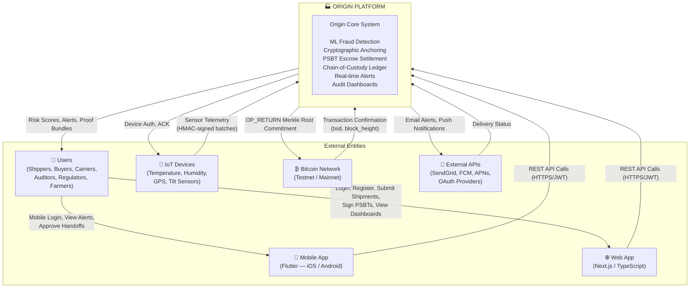
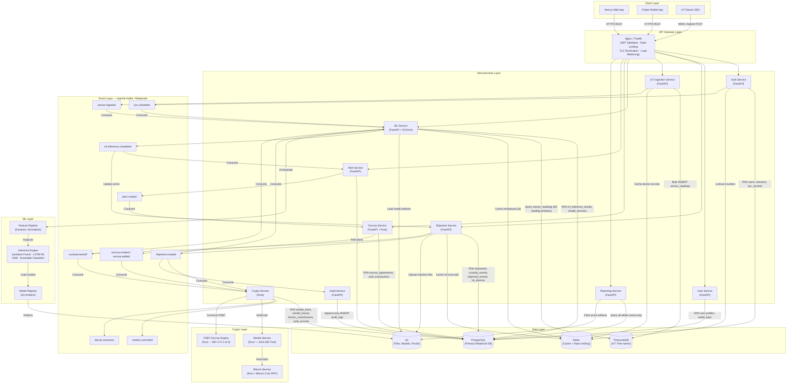
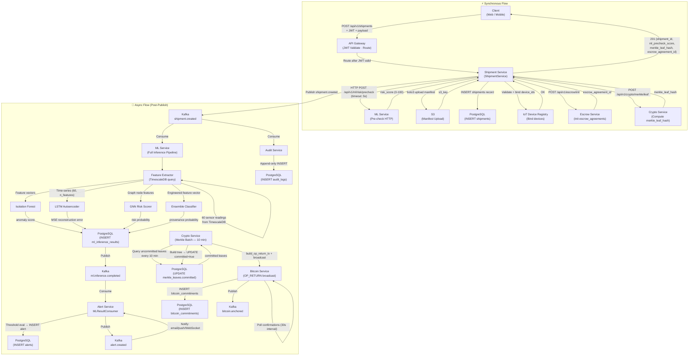
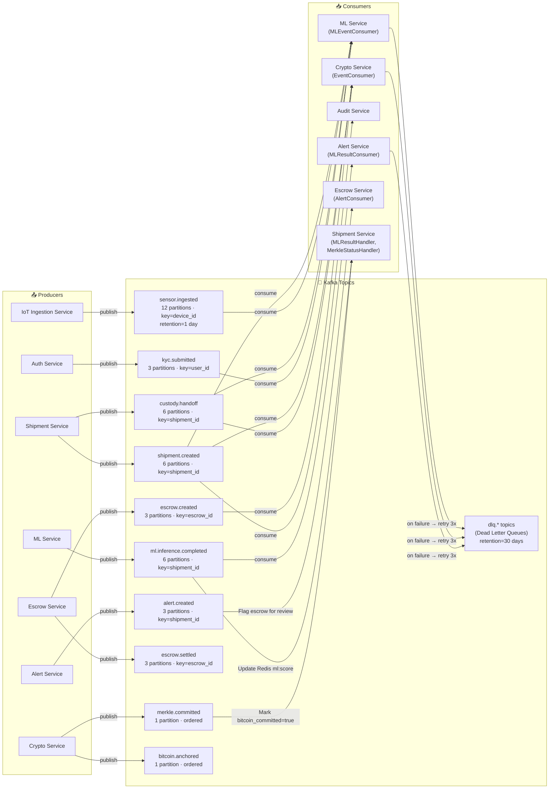
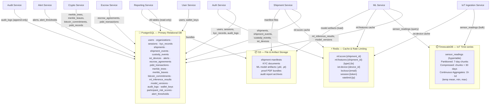
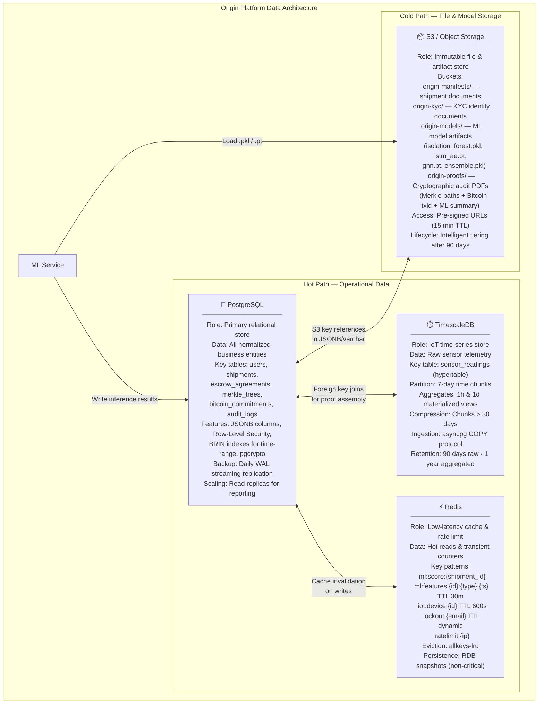

# Origin — Data Flow Diagrams

**Agricultural Supply Chain Fraud Detection System**
**Author:** Jagadish Sunil Pednekar | **Version:** 1.0 | **February 2026**

---

## Table of Contents

1. [Level-0 DFD — System Context Diagram](#level-0-dfd--system-context-diagram)
2. [Level-1 DFD — Service Level](#level-1-dfd--service-level)
3. [Level-2 DFD — Shipment Creation Flow](#level-2-dfd--shipment-creation-flow)
4. [Event Flow Diagram — Kafka Async Architecture](#event-flow-diagram--kafka-async-architecture)
5. [Database Architecture Diagram](#database-architecture-diagram)
6. [Storage Architecture Diagram](#storage-architecture-diagram)
7. [Data Lifecycle Flow](#data-lifecycle-flow)

---

## Level-0 DFD — System Context Diagram

> Shows all external entities and their interaction with the Origin platform as a black box.



---

## Level-1 DFD — Service Level

> Shows data flow from Client → API Gateway → Microservices → Databases → Kafka → ML → Crypto → Storage.



---

## Level-2 DFD — Shipment Creation Flow

> Full synchronous and asynchronous flow for a single shipment submission, from user to Bitcoin.



---

## Event Flow Diagram — Kafka Async Architecture

> Complete Kafka topic map with all producers and consumers.



---

## Database Architecture Diagram

> Shows which services write to which data stores.



---

## Storage Architecture Diagram

> Detailed storage role and data classification per store.



---

## Data Lifecycle Flow

> End-to-end numbered flow from shipment creation to Bitcoin anchoring and escrow settlement.

```
SHIPMENT CREATION
══════════════════════════════════════════════════════════
 1. Shipper submits POST /api/v1/shipments via Web/Mobile app
 2. API Gateway validates JWT (RS256), checks org_id role claim
 3. Shipment Service calls ML Service for pre-check risk score (HTTP, sync, 5s timeout)
 4. ML Service returns ml_precheck_score from ensemble classifier
 5. Shipment Service uploads manifest files to S3 → stores s3_key
 6. Shipment Service INSERTs shipments record into PostgreSQL (status=active)
 7. Shipment Service binds IoT device_ids to shipment in iot_devices table
 8. Shipment Service calls Escrow Service → INSERTs escrow_agreements (status=initialized)
 9. Shipment Service calls Crypto Service → computes SHA-256 merkle_leaf_hash
10. merkle_leaf_hash stored in PostgreSQL merkle_leaves (committed=false)
11. Shipment Service publishes shipment.created to Kafka (acks=all)
12. Shipment Service returns 201 to client: {shipment_id, ml_precheck_score, merkle_leaf_hash, escrow_agreement_id}

IOT SENSOR INGESTION
══════════════════════════════════════════════════════════
13. IoT device sends POST /api/v1/iot/ingest with HMAC-signed sensor batch
14. IoT Ingestion Service validates HMAC signature and device-to-shipment binding
15. Sensor readings bulk-inserted into TimescaleDB sensor_readings hypertable
16. IoT Ingestion Service publishes sensor.ingested to Kafka (keyed by device_id)

ML INFERENCE PIPELINE
══════════════════════════════════════════════════════════
17. ML Service consumes shipment.created, sensor.ingested, custody.handoff events
18. FeatureExtractor queries last 60 readings from TimescaleDB for the shipment
19. Features computed: cumulative_exposure, rate_of_temperature_change,
    route_deviation_score, handling_violation_score, provenance_consistency_score
20. Features cached in Redis: ml:features:{shipment_id}:{type}:{ts} (TTL: 30 min)
21. Isolation Forest runs anomaly detection on sensor feature vectors → score 0-100
22. LSTM Autoencoder reconstructs 60-reading sequence → MSE reconstruction error → score
23. GNN runs on heterogeneous supply chain graph → route deviation + participant risk
24. Ensemble Classifier (XGBoost + Random Forest) → provenance probability 0.0-1.0
25. Composite risk_score persisted to ml_inference_results in PostgreSQL
26. Risk score cached in Redis: ml:score:{shipment_id}
27. ML Service publishes ml.inference.completed to Kafka

ALERT GENERATION
══════════════════════════════════════════════════════════
28. Alert Service consumes ml.inference.completed
29. ThresholdEvaluator compares risk_score against alert_thresholds table
    WARNING threshold: 50 | CRITICAL threshold: 75
30. If threshold breached: INSERT alert into PostgreSQL alerts table
31. NotificationDispatcher sends: email (SendGrid/SES), push (FCM/APNs), WebSocket
32. Alert Service publishes alert.created to Kafka
33. If alert is CRITICAL: Escrow Service flags escrow_agreements.status = flagged_for_review

CUSTODY HANDOFF
══════════════════════════════════════════════════════════
34. Carrier submits custody handoff via POST /api/v1/shipments/{id}/custody
35. Shipment Service INSERTs custody_events with ECDSA signature + GPS coordinates
36. Event hash chained to previous_event_hash (tamper-evident chain)
37. custody.handoff published to Kafka → triggers ML re-inference on full route data

MERKLE TREE CONSTRUCTION
══════════════════════════════════════════════════════════
38. Crypto Service Rust scheduler runs every 10 minutes (Tokio interval)
39. Queries all merkle_leaves WHERE committed = false
40. If leaves exist: MerkleModule.build_tree() executes:
    a. Sort leaves by created_at (deterministic ordering)
    b. SHA-256 hash each leaf (double-hash per Merkle convention)
    c. Iteratively hash sibling pairs → single Merkle root
    d. If odd leaf count: duplicate last leaf
41. Merkle root and all intermediate nodes stored in merkle_trees table
42. Proof paths (sibling hash chains) stored in merkle_leaves.proof_path (JSONB)
43. All processed leaves marked committed=true with tree_id FK
44. merkle.committed published to Kafka
45. Shipment Service consumer marks relevant shipment_events as bitcoin_committed=true

BITCOIN ANCHORING
══════════════════════════════════════════════════════════
46. BitcoinModule.build_op_return_tx() constructs Bitcoin transaction:
    - Input: system wallet UTXO (fetched via bitcoincore-rpc)
    - Output 1: OP_RETURN <merkle_root_32_bytes> (zero-value data output)
    - Output 2: Change output to system wallet (minus miner fee)
    - Fee: estimatesmartfee RPC targeting 1-block confirmation
47. Transaction signed with system wallet private key (from Vault)
48. Transaction broadcast via sendrawtransaction RPC
49. Tokio background task polls gettransaction every 30 seconds until confirmations ≥ 1
50. On confirmation: INSERT bitcoin_commitments (txid, block_height, block_hash, confirmed_at)
51. bitcoin.anchored published to Kafka
52. RBF retry: If unconfirmed after 20 min → bump fee → re-broadcast (max 3 attempts)

PSBT ESCROW SETTLEMENT
══════════════════════════════════════════════════════════
53. Escrow Service receives escrow.created event → PSBTModule.create_multisig_psbt()
54. 2-of-3 P2WSH multisig PSBT constructed:
    - Keys: buyer_pubkey, seller_pubkey, platform_escrow_pubkey
    - Output: escrow_amount_satoshis locked to multisig address
55. Unsigned PSBT serialized to base64 → stored in psbt_transactions (status=pending)
56. Buyer calls POST /api/v1/escrow/{id}/psbt/sign with partial signature (signer_role=buyer)
57. Crypto Service validates partial signature using bitcoin crate PSBT primitives
58. Partial signature stored in psbt_transactions.signatures JSONB
59. Seller calls POST /api/v1/escrow/{id}/psbt/sign with partial signature (signer_role=seller)
60. 2-of-3 threshold reached → PSBTModule.finalize_psbt() produces fully signed transaction
61. Finalized TX broadcast via Bitcoin Core RPC
62. escrow_agreements.status = released | bitcoin_release_txid stored
63. escrow.settled published to Kafka
64. Audit Service inserts final settlement audit_log record

AUDIT & REPORTING
══════════════════════════════════════════════════════════
65. Audit Service consumes all Kafka events → append-only INSERT into audit_logs
66. audit_logs protected by PostgreSQL Row-Level Security (no UPDATE/DELETE for service roles)
67. Reporting Service generates proof PDF bundle on request:
    - Merkle proof path (leaf → root sibling hash chain)
    - Bitcoin txid + block_height + block_hash
    - ML inference summary (all model scores + feature snapshot)
    - Chain-of-custody event log with ECDSA signatures
68. Proof PDF uploaded to S3 origin-proofs/ and served via pre-signed URL (15 min TTL)
```

---

*Generated for Origin Agricultural Supply Chain Fraud Detection System — February 2026*
*All diagrams are implementation-ready for backend engineering teams.*
