# Origin — Database Schema Diagram (ERD)

**Agricultural Supply Chain Fraud Detection System**
**Author:** Jagadish Sunil Pednekar | **Version:** 1.0 | **February 2026**

---

## Table of Contents

1. [Entity Relationship Diagram (Mermaid)](#entity-relationship-diagram-mermaid)
2. [dbdiagram.io Format (Copy-Paste Ready)](#dbdiagramio-format-copy-paste-ready)
3. [Table Structures — Detailed Reference](#table-structures--detailed-reference)
4. [Service-to-Database Mapping](#service-to-database-mapping)

---

## Entity Relationship Diagram (Mermaid)

```mermaid
erDiagram
    organizations {
        uuid id PK
        varchar legal_name
        varchar tax_id UK
        varchar hq_country
        varchar status
        timestamp created_at
    }

    users {
        uuid id PK
        varchar email UK
        varchar password_hash
        varchar role
        uuid org_id FK
        varchar kyc_status
        varchar status
        varchar totp_secret
        timestamp last_login_at
        timestamp created_at
        timestamp updated_at
    }

    user_sessions {
        uuid id PK
        uuid user_id FK
        varchar refresh_token UK
        varchar device_fingerprint
        inet ip_address
        timestamp expires_at
        timestamp created_at
    }

    kyc_records {
        uuid id PK
        uuid user_id FK
        varchar document_type
        varchar s3_document_key
        varchar status
        varchar rejection_reason
        timestamp submitted_at
        timestamp reviewed_at
    }

    wallet_keys {
        uuid id PK
        uuid user_id FK
        varchar public_key
        varchar key_type
        boolean is_active
        timestamp created_at
    }

    iot_devices {
        uuid id PK
        varchar device_serial UK
        uuid shipment_id FK
        uuid org_id FK
        varchar hmac_key_hash
        varchar status
        timestamp bound_at
        timestamp last_heartbeat_at
    }

    shipments {
        uuid id PK
        varchar shipment_code UK
        uuid org_id FK
        uuid carrier_org_id FK
        uuid buyer_org_id FK
        varchar origin_port
        varchar destination_port
        varchar cargo_category
        decimal weight_kg
        varchar status
        decimal ml_risk_score
        varchar merkle_leaf_hash
        varchar manifest_s3_key
        timestamp estimated_departure
        timestamp actual_arrival
        timestamp created_at
        timestamp updated_at
    }

    shipment_events {
        uuid id PK
        uuid shipment_id FK
        varchar event_type
        jsonb payload
        boolean bitcoin_committed
        varchar actor_user_id
        timestamp created_at
    }

    custody_events {
        uuid id PK
        uuid shipment_id FK
        uuid custodian_org_id FK
        varchar event_type
        decimal gps_latitude
        decimal gps_longitude
        text ecdsa_signature
        varchar signature_public_key
        varchar event_hash
        varchar previous_event_hash
        timestamp timestamp
    }

    sensor_readings {
        uuid id PK
        uuid device_id FK
        uuid shipment_id FK
        timestamp timestamp
        decimal temperature_celsius
        decimal humidity_percent
        decimal latitude
        decimal longitude
        decimal tilt_degrees
    }

    ml_inference_results {
        uuid id PK
        uuid shipment_id FK
        uuid model_version_id FK
        varchar inference_type
        decimal risk_score
        decimal confidence
        boolean anomaly_flag
        jsonb features_snapshot
        timestamp created_at
    }

    model_versions {
        uuid id PK
        varchar model_type
        varchar version_tag
        varchar artifact_s3_path
        boolean is_active
        timestamp trained_at
        timestamp deployed_at
    }

    alerts {
        uuid id PK
        uuid shipment_id FK
        varchar alert_type
        varchar severity
        varchar status
        decimal ml_confidence
        text message
        timestamp created_at
        timestamp updated_at
    }

    alert_thresholds {
        uuid id PK
        varchar cargo_category
        varchar alert_type
        decimal warning_threshold
        decimal critical_threshold
        timestamp updated_at
    }

    escrow_agreements {
        uuid id PK
        uuid shipment_id FK
        uuid buyer_org_id FK
        uuid seller_org_id FK
        bigint amount_satoshis
        jsonb release_conditions
        varchar status
        varchar bitcoin_funding_txid
        varchar bitcoin_release_txid
        timestamp created_at
        timestamp updated_at
    }

    psbt_transactions {
        uuid id PK
        uuid escrow_agreement_id FK
        varchar psbt_type
        text psbt_base64
        jsonb signatures
        varchar status
        varchar txid
        timestamp created_at
    }

    merkle_trees {
        uuid id PK
        varchar root_hash UK
        integer leaf_count
        uuid bitcoin_commitment_id FK
        timestamp commitment_timestamp
    }

    merkle_leaves {
        uuid id PK
        uuid tree_id FK
        uuid shipment_id FK
        varchar event_type
        varchar leaf_hash
        jsonb proof_path
        boolean committed
        timestamp created_at
    }

    bitcoin_commitments {
        uuid id PK
        uuid merkle_tree_id FK
        varchar txid UK
        integer block_height
        varchar block_hash
        varchar network
        timestamp confirmed_at
    }

    psbt_records {
        uuid id PK
        uuid escrow_agreement_id FK
        varchar psbt_type
        varchar status
        text final_txid
        timestamp created_at
    }

    audit_logs {
        uuid id PK
        varchar event_type
        varchar source_service
        varchar entity_type
        uuid entity_id
        uuid actor_user_id
        jsonb payload
        timestamp timestamp
    }

    participant_risk_scores {
        uuid id PK
        uuid org_id FK
        decimal risk_score
        varchar model_version
        date score_date
        timestamp created_at
    }

    organizations ||--o{ users : "has members"
    organizations ||--o{ shipments : "ships as org_id"
    organizations ||--o{ shipments : "carries as carrier_org_id"
    organizations ||--o{ shipments : "buys as buyer_org_id"
    organizations ||--o{ iot_devices : "owns"
    organizations ||--o{ escrow_agreements : "buyer"
    organizations ||--o{ escrow_agreements : "seller"
    organizations ||--o{ custody_events : "custodian"
    organizations ||--o{ participant_risk_scores : "scored"

    users ||--o{ user_sessions : "has sessions"
    users ||--o| kyc_records : "has KYC"
    users ||--o{ wallet_keys : "has keys"

    shipments ||--o{ iot_devices : "has devices"
    shipments ||--o{ shipment_events : "has events"
    shipments ||--o{ custody_events : "has custody chain"
    shipments ||--o{ sensor_readings : "has readings"
    shipments ||--o{ ml_inference_results : "has inferences"
    shipments ||--o{ alerts : "has alerts"
    shipments ||--o| escrow_agreements : "has escrow"
    shipments ||--o{ merkle_leaves : "has leaves"

    ml_inference_results }o--|| model_versions : "uses version"

    escrow_agreements ||--o{ psbt_transactions : "has PSBTs"
    escrow_agreements ||--o{ psbt_records : "has records"

    merkle_trees ||--o{ merkle_leaves : "contains"
    merkle_trees ||--o| bitcoin_commitments : "anchored by"
    bitcoin_commitments ||--|| merkle_trees : "commits"
```



---

## dbdiagram.io Format (Copy-Paste Ready)

> Paste this directly at [https://dbdiagram.io](https://dbdiagram.io) to render the full ERD.

```
// Origin — Agricultural Supply Chain Fraud Detection System
// Database Schema v1.0 | February 2026

Table organizations {
  id uuid [pk, default: `gen_random_uuid()`]
  legal_name varchar(255) [not null]
  tax_id varchar(100) [unique, not null, note: 'idx_org_tax_id']
  hq_country varchar(10) [not null, note: 'ISO 3166-1 alpha-2']
  status varchar(50) [not null, note: 'enum: pending_verification, active, suspended']
  created_at timestamptz [not null, default: `now()`]

  indexes {
    tax_id [unique, name: 'idx_org_tax_id']
    status [name: 'idx_org_status']
  }
}

Table users {
  id uuid [pk, default: `gen_random_uuid()`]
  email varchar(255) [unique, not null]
  password_hash varchar(255) [note: 'bcrypt cost=12; null for SSO-only users']
  role varchar(50) [not null, note: 'enum: shipper, carrier, auditor, financier, admin, regulator, farmer']
  org_id uuid [ref: > organizations.id, not null]
  kyc_status varchar(50) [not null, default: 'pending', note: 'enum: pending, approved, rejected']
  status varchar(50) [not null, default: 'pending_email_verification', note: 'enum: active, suspended, pending_email_verification, locked']
  totp_secret varchar(64) [note: 'encrypted TOTP seed; null if 2FA not enabled']
  failed_login_count int [not null, default: 0]
  last_login_at timestamptz
  created_at timestamptz [not null, default: `now()`]
  updated_at timestamptz [not null, default: `now()`]

  indexes {
    email [unique, name: 'idx_users_email']
    org_id [name: 'idx_users_org_id']
    status [name: 'idx_users_status']
  }
}

Table user_sessions {
  id uuid [pk, default: `gen_random_uuid()`]
  user_id uuid [ref: > users.id, not null]
  refresh_token varchar(255) [unique, not null]
  device_fingerprint varchar(255)
  ip_address inet
  is_2fa_verified boolean [not null, default: false]
  expires_at timestamptz [not null]
  created_at timestamptz [not null, default: `now()`]

  indexes {
    refresh_token [unique, name: 'idx_sessions_token']
    user_id [name: 'idx_sessions_user_id']
  }
}

Table kyc_records {
  id uuid [pk, default: `gen_random_uuid()`]
  user_id uuid [ref: > users.id, not null]
  document_type varchar(100) [not null, note: 'enum: business_license, articles_of_incorporation, government_id']
  s3_document_key varchar(512) [not null]
  status varchar(50) [not null, default: 'pending', note: 'enum: pending, under_review, approved, rejected']
  rejection_reason text
  submitted_at timestamptz [not null, default: `now()`]
  reviewed_at timestamptz

  indexes {
    user_id [name: 'idx_kyc_user_id']
    status [name: 'idx_kyc_status']
  }
}

Table wallet_keys {
  id uuid [pk, default: `gen_random_uuid()`]
  user_id uuid [ref: > users.id, not null]
  public_key text [not null, note: 'compressed secp256k1 public key hex']
  key_type varchar(50) [not null, note: 'enum: escrow_signer, audit_verifier']
  is_active boolean [not null, default: true]
  created_at timestamptz [not null, default: `now()`]

  indexes {
    user_id [name: 'idx_wallet_user_id']
  }
}

Table iot_devices {
  id uuid [pk, default: `gen_random_uuid()`]
  device_serial varchar(255) [unique, not null]
  shipment_id uuid [ref: > shipments.id]
  org_id uuid [ref: > organizations.id, not null]
  hmac_key_hash varchar(255) [not null, note: 'SHA-256 of device pre-shared HMAC key']
  status varchar(50) [not null, default: 'unbound', note: 'enum: unbound, active, stale, decommissioned']
  last_heartbeat_at timestamptz
  bound_at timestamptz

  indexes {
    device_serial [unique, name: 'idx_device_serial']
    shipment_id [name: 'idx_device_shipment_id']
    org_id [name: 'idx_device_org_id']
  }
}

Table shipments {
  id uuid [pk, default: `gen_random_uuid()`]
  shipment_code varchar(20) [unique, not null, note: 'formatted as SHP-XXXXX']
  org_id uuid [ref: > organizations.id, not null, note: 'shipper org']
  carrier_org_id uuid [ref: > organizations.id]
  buyer_org_id uuid [ref: > organizations.id]
  origin_port varchar(10) [not null, note: 'UN/LOCODE']
  destination_port varchar(10) [not null, note: 'UN/LOCODE']
  cargo_category varchar(100) [not null, note: 'e.g. fresh_produce, grains, dairy']
  weight_kg decimal(10,2)
  status varchar(50) [not null, default: 'draft', note: 'enum: draft, active, in_transit, delivered, disputed, cancelled']
  ml_risk_score decimal(5,2) [note: '0.00 to 100.00']
  merkle_leaf_hash varchar(64) [note: 'SHA-256 leaf hash for Merkle inclusion']
  manifest_s3_key varchar(512)
  estimated_departure timestamptz
  actual_arrival timestamptz
  created_at timestamptz [not null, default: `now()`]
  updated_at timestamptz [not null, default: `now()`]

  indexes {
    org_id [name: 'idx_shipments_org_id']
    carrier_org_id [name: 'idx_shipments_carrier_org_id']
    status [name: 'idx_shipments_status']
    created_at [name: 'idx_shipments_created_at', type: brin, note: 'BRIN for time-range queries']
    merkle_leaf_hash [name: 'idx_shipments_leaf_hash']
  }
}

Table shipment_events {
  id uuid [pk, default: `gen_random_uuid()`]
  shipment_id uuid [ref: > shipments.id, not null]
  event_type varchar(100) [not null, note: 'e.g. created, status_change, document_uploaded, ml_scored']
  payload jsonb [note: 'event-specific metadata']
  bitcoin_committed boolean [not null, default: false]
  actor_user_id uuid
  created_at timestamptz [not null, default: `now()`]

  indexes {
    shipment_id [name: 'idx_shipment_events_shipment_id']
    created_at [name: 'idx_shipment_events_created_at', type: brin]
    bitcoin_committed [name: 'idx_shipment_events_committed']
  }
}

Table custody_events {
  id uuid [pk, default: `gen_random_uuid()`]
  shipment_id uuid [ref: > shipments.id, not null]
  custodian_org_id uuid [ref: > organizations.id, not null]
  event_type varchar(50) [not null, note: 'enum: pickup, handoff, delivery, inspection']
  gps_latitude decimal(9,6)
  gps_longitude decimal(9,6)
  ecdsa_signature text [not null, note: 'secp256k1 ECDSA signature by custodian']
  signature_public_key varchar(130) [not null, note: 'compressed secp256k1 public key hex']
  event_hash varchar(64) [not null, note: 'SHA-256(event_type||shipment_id||timestamp||payload)']
  previous_event_hash varchar(64) [note: 'hash chain: null for first event']
  timestamp timestamptz [not null]

  indexes {
    shipment_id [name: 'idx_custody_shipment_id']
    custodian_org_id [name: 'idx_custody_org_id']
    timestamp [name: 'idx_custody_timestamp', type: brin]
  }
}

Table sensor_readings {
  id uuid [pk, default: `gen_random_uuid()`]
  device_id uuid [ref: > iot_devices.id, not null]
  shipment_id uuid [ref: > shipments.id, not null]
  timestamp timestamptz [not null, note: 'TimescaleDB partition key — 7-day chunks']
  temperature_celsius decimal(6,3)
  humidity_percent decimal(6,3)
  latitude decimal(9,6)
  longitude decimal(9,6)
  tilt_degrees decimal(6,3)

  indexes {
    (device_id, timestamp) [name: 'idx_sensor_device_time']
    (shipment_id, timestamp) [name: 'idx_sensor_shipment_time']
  }

  note: 'TimescaleDB hypertable partitioned by timestamp (7-day chunks). Continuous aggregates: 1h and 1d materialized views. Compression: chunks > 30 days. Retention: 90 days raw.'
}

Table ml_inference_results {
  id uuid [pk, default: `gen_random_uuid()`]
  shipment_id uuid [ref: > shipments.id, not null]
  model_version_id uuid [ref: > model_versions.id, not null]
  inference_type varchar(100) [not null, note: 'enum: spoilage, route_deviation, tampering, provenance, participant_risk']
  risk_score decimal(5,2) [not null, note: '0.00 to 100.00']
  confidence decimal(5,4) [note: '0.0000 to 1.0000']
  anomaly_flag boolean [not null, default: false]
  features_snapshot jsonb [note: 'engineered feature values at inference time']
  created_at timestamptz [not null, default: `now()`]

  indexes {
    shipment_id [name: 'idx_ml_shipment_id']
    inference_type [name: 'idx_ml_inference_type']
    created_at [name: 'idx_ml_created_at', type: brin]
    anomaly_flag [name: 'idx_ml_anomaly_flag']
  }
}

Table model_versions {
  id uuid [pk, default: `gen_random_uuid()`]
  model_type varchar(100) [not null, note: 'enum: isolation_forest, lstm_autoencoder, gnn, ensemble']
  version_tag varchar(50) [not null, note: 'semver string e.g. 1.2.3']
  artifact_s3_path varchar(512) [not null, note: 'S3 path to .pkl or .pt file']
  is_active boolean [not null, default: false]
  trained_at timestamptz
  deployed_at timestamptz

  indexes {
    (model_type, is_active) [name: 'idx_model_type_active']
  }
}

Table alerts {
  id uuid [pk, default: `gen_random_uuid()`]
  shipment_id uuid [ref: > shipments.id, not null]
  alert_type varchar(100) [not null, note: 'enum: route_deviation, sensor_breach, unscheduled_handover, ml_risk_trend, tampering_detected']
  severity varchar(50) [not null, note: 'enum: info, warning, critical']
  status varchar(50) [not null, default: 'open', note: 'enum: open, acknowledged, resolved, disputed']
  ml_confidence decimal(5,4)
  message text [not null]
  created_at timestamptz [not null, default: `now()`]
  updated_at timestamptz [not null, default: `now()`]

  indexes {
    shipment_id [name: 'idx_alerts_shipment_id']
    severity [name: 'idx_alerts_severity']
    status [name: 'idx_alerts_status']
    created_at [name: 'idx_alerts_created_at', type: brin]
  }
}

Table alert_thresholds {
  id uuid [pk, default: `gen_random_uuid()`]
  cargo_category varchar(100) [note: 'null = default for all categories']
  alert_type varchar(100) [not null]
  warning_threshold decimal(5,2) [not null, default: 50.0]
  critical_threshold decimal(5,2) [not null, default: 75.0]
  updated_at timestamptz [not null, default: `now()`]

  indexes {
    (cargo_category, alert_type) [unique, name: 'idx_thresholds_category_type']
  }
}

Table escrow_agreements {
  id uuid [pk, default: `gen_random_uuid()`]
  shipment_id uuid [ref: > shipments.id, not null]
  buyer_org_id uuid [ref: > organizations.id, not null]
  seller_org_id uuid [ref: > organizations.id, not null]
  amount_satoshis bigint [not null]
  release_conditions jsonb [not null, note: 'e.g. {max_risk_score: 30, require_delivery_confirmation: true}']
  status varchar(50) [not null, default: 'initialized', note: 'enum: initialized, funded, released, disputed, cancelled, flagged_for_review']
  bitcoin_funding_txid varchar(64)
  bitcoin_release_txid varchar(64)
  created_at timestamptz [not null, default: `now()`]
  updated_at timestamptz [not null, default: `now()`]

  indexes {
    shipment_id [unique, name: 'idx_escrow_shipment_id']
    status [name: 'idx_escrow_status']
    buyer_org_id [name: 'idx_escrow_buyer']
    seller_org_id [name: 'idx_escrow_seller']
  }
}

Table psbt_transactions {
  id uuid [pk, default: `gen_random_uuid()`]
  escrow_agreement_id uuid [ref: > escrow_agreements.id, not null]
  psbt_type varchar(50) [not null, note: 'enum: funding, release, dispute_resolution']
  psbt_base64 text [not null, note: 'BIP-174 PSBT serialized as base64; updated on each partial sig merge']
  signatures jsonb [not null, default: '{}', note: 'map of signer_role to partial_sig_base64']
  status varchar(50) [not null, default: 'pending', note: 'enum: pending, partially_signed, finalized, broadcast']
  txid varchar(64) [note: 'set after broadcast']
  created_at timestamptz [not null, default: `now()`]

  indexes {
    escrow_agreement_id [name: 'idx_psbt_escrow_id']
    status [name: 'idx_psbt_status']
  }
}

Table merkle_trees {
  id uuid [pk, default: `gen_random_uuid()`]
  root_hash varchar(64) [unique, not null, note: 'SHA-256 Merkle root']
  leaf_count int [not null]
  bitcoin_commitment_id uuid [ref: > bitcoin_commitments.id, note: 'null until anchored to Bitcoin']
  commitment_timestamp timestamptz [not null, default: `now()`]

  indexes {
    root_hash [unique, name: 'idx_merkle_root_hash']
  }
}

Table merkle_leaves {
  id uuid [pk, default: `gen_random_uuid()`]
  tree_id uuid [ref: > merkle_trees.id, note: 'null until committed to a batch']
  shipment_id uuid [ref: > shipments.id, not null]
  event_type varchar(100) [not null, note: 'e.g. shipment_created, custody_handoff, sensor_anomaly']
  leaf_hash varchar(64) [not null, note: 'SHA-256(event_type||shipment_id||timestamp||payload)']
  proof_path jsonb [note: 'sibling hash array from leaf to root; populated on batch commit']
  committed boolean [not null, default: false]
  created_at timestamptz [not null, default: `now()`]

  indexes {
    shipment_id [name: 'idx_leaf_shipment_id']
    committed [name: 'idx_leaf_committed']
    created_at [name: 'idx_leaf_created_at', type: brin]
  }
}

Table bitcoin_commitments {
  id uuid [pk, default: `gen_random_uuid()`]
  merkle_tree_id uuid [ref: > merkle_trees.id, not null]
  txid varchar(64) [unique, not null, note: 'Bitcoin transaction ID of OP_RETURN commitment']
  block_height int
  block_hash varchar(64)
  network varchar(20) [not null, note: 'enum: testnet, mainnet']
  confirmed_at timestamptz

  indexes {
    txid [unique, name: 'idx_btc_txid']
    merkle_tree_id [unique, name: 'idx_btc_tree_id']
  }
}

Table psbt_records {
  id uuid [pk, default: `gen_random_uuid()`]
  escrow_agreement_id uuid [ref: > escrow_agreements.id, not null]
  psbt_type varchar(50) [not null]
  status varchar(50) [not null, note: 'enum: pending, finalized, broadcast']
  final_txid text
  created_at timestamptz [not null, default: `now()`]
}

Table audit_logs {
  id uuid [pk, default: `gen_random_uuid()`]
  event_type varchar(200) [not null]
  source_service varchar(100) [not null, note: 'e.g. auth_service, shipment_service']
  entity_type varchar(100) [note: 'e.g. shipment, user, escrow']
  entity_id uuid
  actor_user_id uuid
  payload jsonb
  timestamp timestamptz [not null, default: `now()`]

  indexes {
    entity_id [name: 'idx_audit_entity']
    timestamp [name: 'idx_audit_timestamp', type: brin]
    source_service [name: 'idx_audit_service']
    actor_user_id [name: 'idx_audit_actor']
  }

  note: 'Append-only. PostgreSQL Row-Level Security prevents UPDATE/DELETE for all service roles. Separate audit_writer PostgreSQL role with INSERT-only permission.'
}

Table participant_risk_scores {
  id uuid [pk, default: `gen_random_uuid()`]
  org_id uuid [ref: > organizations.id, not null]
  risk_score decimal(5,2) [not null, note: '0.00 to 100.00 — GNN-derived daily score']
  model_version varchar(50)
  score_date date [not null]
  created_at timestamptz [not null, default: `now()`]

  indexes {
    (org_id, score_date) [unique, name: 'idx_risk_org_date']
    score_date [name: 'idx_risk_date']
  }
}
```

---

## Table Structures — Detailed Reference

### TABLE: `organizations`

**Purpose:** Root entity for all supply chain participants (shippers, carriers, buyers, auditors, etc.)

| Column | Type | Constraints | Notes |
|--------|------|-------------|-------|
| `id` | uuid | PK | `gen_random_uuid()` |
| `legal_name` | varchar(255) | NOT NULL | Registered company name |
| `tax_id` | varchar(100) | UNIQUE, NOT NULL | Business tax ID; unique per jurisdiction |
| `hq_country` | varchar(10) | NOT NULL | ISO 3166-1 alpha-2 country code |
| `status` | varchar(50) | NOT NULL | `pending_verification`, `active`, `suspended` |
| `created_at` | timestamptz | NOT NULL | Default: `now()` |

**Indexes:** `idx_org_tax_id` (unique), `idx_org_status`

---

### TABLE: `users`

**Purpose:** Individual user accounts linked to an organization with role-based access.

| Column | Type | Constraints | Notes |
|--------|------|-------------|-------|
| `id` | uuid | PK | |
| `email` | varchar(255) | UNIQUE, NOT NULL | Login identifier |
| `password_hash` | varchar(255) | | bcrypt cost=12; null for SSO-only |
| `role` | varchar(50) | NOT NULL | `shipper`, `carrier`, `auditor`, `financier`, `admin`, `regulator`, `farmer` |
| `org_id` | uuid | FK → organizations.id | |
| `kyc_status` | varchar(50) | NOT NULL | `pending`, `approved`, `rejected` |
| `status` | varchar(50) | NOT NULL | `active`, `suspended`, `pending_email_verification`, `locked` |
| `totp_secret` | varchar(64) | | Encrypted TOTP seed; null if 2FA disabled |
| `failed_login_count` | int | NOT NULL, DEFAULT 0 | Lockout after 5 failures |
| `last_login_at` | timestamptz | | |
| `created_at` | timestamptz | NOT NULL | |
| `updated_at` | timestamptz | NOT NULL | |

**Indexes:** `idx_users_email` (unique), `idx_users_org_id`, `idx_users_status`

---

### TABLE: `user_sessions`

**Purpose:** Active refresh token sessions per user.

| Column | Type | Constraints | Notes |
|--------|------|-------------|-------|
| `id` | uuid | PK | |
| `user_id` | uuid | FK → users.id, NOT NULL | |
| `refresh_token` | varchar(255) | UNIQUE, NOT NULL | Rotated on each access token refresh |
| `device_fingerprint` | varchar(255) | | For `remember_device` feature |
| `ip_address` | inet | | Login source IP |
| `is_2fa_verified` | boolean | NOT NULL, DEFAULT false | |
| `expires_at` | timestamptz | NOT NULL | 30-day refresh token expiry |
| `created_at` | timestamptz | NOT NULL | |

**Indexes:** `idx_sessions_token` (unique), `idx_sessions_user_id`

---

### TABLE: `kyc_records`

**Purpose:** KYC document submissions and review status per user.

| Column | Type | Constraints | Notes |
|--------|------|-------------|-------|
| `id` | uuid | PK | |
| `user_id` | uuid | FK → users.id, NOT NULL | |
| `document_type` | varchar(100) | NOT NULL | `business_license`, `articles_of_incorporation`, `government_id` |
| `s3_document_key` | varchar(512) | NOT NULL | S3 object path |
| `status` | varchar(50) | NOT NULL | `pending`, `under_review`, `approved`, `rejected` |
| `rejection_reason` | text | | Populated on rejection |
| `submitted_at` | timestamptz | NOT NULL | |
| `reviewed_at` | timestamptz | | |

**Indexes:** `idx_kyc_user_id`, `idx_kyc_status`

---

### TABLE: `wallet_keys`

**Purpose:** Bitcoin public keys registered per user for PSBT signing.

| Column | Type | Constraints | Notes |
|--------|------|-------------|-------|
| `id` | uuid | PK | |
| `user_id` | uuid | FK → users.id, NOT NULL | |
| `public_key` | text | NOT NULL | Compressed secp256k1 hex |
| `key_type` | varchar(50) | NOT NULL | `escrow_signer`, `audit_verifier` |
| `is_active` | boolean | NOT NULL, DEFAULT true | |
| `created_at` | timestamptz | NOT NULL | |

**Indexes:** `idx_wallet_user_id`

---

### TABLE: `iot_devices`

**Purpose:** Registered IoT sensors bound to shipments.

| Column | Type | Constraints | Notes |
|--------|------|-------------|-------|
| `id` | uuid | PK | |
| `device_serial` | varchar(255) | UNIQUE, NOT NULL | Hardware serial number |
| `shipment_id` | uuid | FK → shipments.id | Null when unbound |
| `org_id` | uuid | FK → organizations.id, NOT NULL | Owning org |
| `hmac_key_hash` | varchar(255) | NOT NULL | SHA-256 of device pre-shared key |
| `status` | varchar(50) | NOT NULL | `unbound`, `active`, `stale`, `decommissioned` |
| `last_heartbeat_at` | timestamptz | | Staleness detection |
| `bound_at` | timestamptz | | When device was bound to shipment |

**Indexes:** `idx_device_serial` (unique), `idx_device_shipment_id`, `idx_device_org_id`
**Cache:** `iot:device:{device_id}` in Redis (TTL: 600s)

---

### TABLE: `shipments`

**Purpose:** Core shipment records with ML risk score and cryptographic leaf hash.

| Column | Type | Constraints | Notes |
|--------|------|-------------|-------|
| `id` | uuid | PK | |
| `shipment_code` | varchar(20) | UNIQUE, NOT NULL | Formatted: `SHP-XXXXX` |
| `org_id` | uuid | FK → organizations.id | Shipper org |
| `carrier_org_id` | uuid | FK → organizations.id | |
| `buyer_org_id` | uuid | FK → organizations.id | |
| `origin_port` | varchar(10) | NOT NULL | UN/LOCODE |
| `destination_port` | varchar(10) | NOT NULL | UN/LOCODE |
| `cargo_category` | varchar(100) | NOT NULL | `fresh_produce`, `grains`, `dairy`, etc. |
| `weight_kg` | decimal(10,2) | | |
| `status` | varchar(50) | NOT NULL | `draft`, `active`, `in_transit`, `delivered`, `disputed`, `cancelled` |
| `ml_risk_score` | decimal(5,2) | | Composite 0-100 from latest inference |
| `merkle_leaf_hash` | varchar(64) | | SHA-256 leaf for Merkle inclusion |
| `manifest_s3_key` | varchar(512) | | S3 object path for manifest PDF |
| `estimated_departure` | timestamptz | | |
| `actual_arrival` | timestamptz | | |
| `created_at` | timestamptz | NOT NULL | |
| `updated_at` | timestamptz | NOT NULL | |

**Indexes:** `idx_shipments_org_id`, `idx_shipments_carrier_org_id`, `idx_shipments_status`, `idx_shipments_created_at` (BRIN), `idx_shipments_leaf_hash`
**Cache:** `ml:score:{shipment_id}` in Redis

---

### TABLE: `shipment_events`

**Purpose:** Immutable event log for all shipment lifecycle state changes.

| Column | Type | Constraints | Notes |
|--------|------|-------------|-------|
| `id` | uuid | PK | |
| `shipment_id` | uuid | FK → shipments.id, NOT NULL | |
| `event_type` | varchar(100) | NOT NULL | `created`, `status_change`, `document_uploaded`, `ml_scored` |
| `payload` | jsonb | | Event-specific metadata |
| `bitcoin_committed` | boolean | NOT NULL, DEFAULT false | Set true by MerkleStatusHandler |
| `actor_user_id` | uuid | | User who triggered event |
| `created_at` | timestamptz | NOT NULL | |

**Indexes:** `idx_shipment_events_shipment_id`, `idx_shipment_events_created_at` (BRIN), `idx_shipment_events_committed`

---

### TABLE: `custody_events`

**Purpose:** Cryptographically signed, hash-chained chain-of-custody ledger.

| Column | Type | Constraints | Notes |
|--------|------|-------------|-------|
| `id` | uuid | PK | |
| `shipment_id` | uuid | FK → shipments.id, NOT NULL | |
| `custodian_org_id` | uuid | FK → organizations.id, NOT NULL | |
| `event_type` | varchar(50) | NOT NULL | `pickup`, `handoff`, `delivery`, `inspection` |
| `gps_latitude` | decimal(9,6) | | |
| `gps_longitude` | decimal(9,6) | | |
| `ecdsa_signature` | text | NOT NULL | secp256k1 ECDSA by custodian |
| `signature_public_key` | varchar(130) | NOT NULL | Compressed secp256k1 hex |
| `event_hash` | varchar(64) | NOT NULL | SHA-256(event_type\|\|shipment_id\|\|timestamp\|\|payload) |
| `previous_event_hash` | varchar(64) | | Hash chain; null for first event |
| `timestamp` | timestamptz | NOT NULL | |

**Indexes:** `idx_custody_shipment_id`, `idx_custody_org_id`, `idx_custody_timestamp` (BRIN)

---

### TABLE: `sensor_readings` *(TimescaleDB Hypertable)*

**Purpose:** Raw IoT telemetry — temperature, humidity, GPS, tilt per device reading.

| Column | Type | Constraints | Notes |
|--------|------|-------------|-------|
| `id` | uuid | PK | |
| `device_id` | uuid | FK → iot_devices.id, NOT NULL | |
| `shipment_id` | uuid | FK → shipments.id, NOT NULL | |
| `timestamp` | timestamptz | NOT NULL | **TimescaleDB partition key** |
| `temperature_celsius` | decimal(6,3) | | |
| `humidity_percent` | decimal(6,3) | | |
| `latitude` | decimal(9,6) | | |
| `longitude` | decimal(9,6) | | |
| `tilt_degrees` | decimal(6,3) | | |

**Indexes:** `idx_sensor_device_time` (device_id, timestamp), `idx_sensor_shipment_time` (shipment_id, timestamp)
**TimescaleDB:** 7-day chunks · Compression after 30 days · Continuous aggregates: 1h + 1d (temp mean/min/max)

---

### TABLE: `ml_inference_results`

**Purpose:** All ML model output scores per shipment per inference type.

| Column | Type | Constraints | Notes |
|--------|------|-------------|-------|
| `id` | uuid | PK | |
| `shipment_id` | uuid | FK → shipments.id, NOT NULL | |
| `model_version_id` | uuid | FK → model_versions.id, NOT NULL | |
| `inference_type` | varchar(100) | NOT NULL | `spoilage`, `route_deviation`, `tampering`, `provenance`, `participant_risk` |
| `risk_score` | decimal(5,2) | NOT NULL | 0.00–100.00 |
| `confidence` | decimal(5,4) | | 0.0000–1.0000 |
| `anomaly_flag` | boolean | NOT NULL, DEFAULT false | |
| `features_snapshot` | jsonb | | Engineered feature values at inference time |
| `created_at` | timestamptz | NOT NULL | |

**Indexes:** `idx_ml_shipment_id`, `idx_ml_inference_type`, `idx_ml_created_at` (BRIN), `idx_ml_anomaly_flag`

---

### TABLE: `model_versions`

**Purpose:** ML model artifact registry with active version tracking.

| Column | Type | Constraints | Notes |
|--------|------|-------------|-------|
| `id` | uuid | PK | |
| `model_type` | varchar(100) | NOT NULL | `isolation_forest`, `lstm_autoencoder`, `gnn`, `ensemble` |
| `version_tag` | varchar(50) | NOT NULL | Semver e.g. `1.2.3` |
| `artifact_s3_path` | varchar(512) | NOT NULL | S3 path to `.pkl` or `.pt` |
| `is_active` | boolean | NOT NULL, DEFAULT false | Only one active per model_type |
| `trained_at` | timestamptz | | |
| `deployed_at` | timestamptz | | |

**Indexes:** `idx_model_type_active` (model_type, is_active)

---

### TABLE: `alerts`

**Purpose:** Fraud and anomaly alerts generated from ML inference results.

| Column | Type | Constraints | Notes |
|--------|------|-------------|-------|
| `id` | uuid | PK | |
| `shipment_id` | uuid | FK → shipments.id, NOT NULL | |
| `alert_type` | varchar(100) | NOT NULL | `route_deviation`, `sensor_breach`, `unscheduled_handover`, `ml_risk_trend`, `tampering_detected` |
| `severity` | varchar(50) | NOT NULL | `info`, `warning`, `critical` |
| `status` | varchar(50) | NOT NULL | `open`, `acknowledged`, `resolved`, `disputed` |
| `ml_confidence` | decimal(5,4) | | |
| `message` | text | NOT NULL | Human-readable alert description |
| `created_at` | timestamptz | NOT NULL | |
| `updated_at` | timestamptz | NOT NULL | |

**Indexes:** `idx_alerts_shipment_id`, `idx_alerts_severity`, `idx_alerts_status`, `idx_alerts_created_at` (BRIN)

---

### TABLE: `alert_thresholds`

**Purpose:** Configurable per-category warning and critical thresholds for ML scores.

| Column | Type | Constraints | Notes |
|--------|------|-------------|-------|
| `id` | uuid | PK | |
| `cargo_category` | varchar(100) | | null = global default |
| `alert_type` | varchar(100) | NOT NULL | |
| `warning_threshold` | decimal(5,2) | NOT NULL, DEFAULT 50.0 | |
| `critical_threshold` | decimal(5,2) | NOT NULL, DEFAULT 75.0 | |
| `updated_at` | timestamptz | NOT NULL | |

**Indexes:** `idx_thresholds_category_type` (unique: cargo_category, alert_type)

---

### TABLE: `escrow_agreements`

**Purpose:** PSBT escrow agreements between buyer and seller per shipment.

| Column | Type | Constraints | Notes |
|--------|------|-------------|-------|
| `id` | uuid | PK | |
| `shipment_id` | uuid | FK → shipments.id, UNIQUE, NOT NULL | One escrow per shipment |
| `buyer_org_id` | uuid | FK → organizations.id, NOT NULL | |
| `seller_org_id` | uuid | FK → organizations.id, NOT NULL | |
| `amount_satoshis` | bigint | NOT NULL | BTC amount in satoshis |
| `release_conditions` | jsonb | NOT NULL | `{max_risk_score, require_delivery_confirmation}` |
| `status` | varchar(50) | NOT NULL | `initialized`, `funded`, `released`, `disputed`, `cancelled`, `flagged_for_review` |
| `bitcoin_funding_txid` | varchar(64) | | Funding TX on Bitcoin network |
| `bitcoin_release_txid` | varchar(64) | | Release TX on Bitcoin network |
| `created_at` | timestamptz | NOT NULL | |
| `updated_at` | timestamptz | NOT NULL | |

**Indexes:** `idx_escrow_shipment_id` (unique), `idx_escrow_status`, `idx_escrow_buyer`, `idx_escrow_seller`

---

### TABLE: `psbt_transactions`

**Purpose:** BIP-174 PSBT state tracking for multisig escrow signature collection.

| Column | Type | Constraints | Notes |
|--------|------|-------------|-------|
| `id` | uuid | PK | |
| `escrow_agreement_id` | uuid | FK → escrow_agreements.id, NOT NULL | |
| `psbt_type` | varchar(50) | NOT NULL | `funding`, `release`, `dispute_resolution` |
| `psbt_base64` | text | NOT NULL | BIP-174 PSBT; updated on each partial sig merge |
| `signatures` | jsonb | NOT NULL, DEFAULT `{}` | Map: `{signer_role: partial_sig_base64}` |
| `status` | varchar(50) | NOT NULL | `pending`, `partially_signed`, `finalized`, `broadcast` |
| `txid` | varchar(64) | | Set after broadcast |
| `created_at` | timestamptz | NOT NULL | |

**Indexes:** `idx_psbt_escrow_id`, `idx_psbt_status`

---

### TABLE: `merkle_trees`

**Purpose:** Constructed Merkle tree batches with root hash.

| Column | Type | Constraints | Notes |
|--------|------|-------------|-------|
| `id` | uuid | PK | |
| `root_hash` | varchar(64) | UNIQUE, NOT NULL | SHA-256 Merkle root |
| `leaf_count` | int | NOT NULL | |
| `bitcoin_commitment_id` | uuid | FK → bitcoin_commitments.id | null until anchored |
| `commitment_timestamp` | timestamptz | NOT NULL | |

**Indexes:** `idx_merkle_root_hash` (unique)

---

### TABLE: `merkle_leaves`

**Purpose:** Individual Merkle leaf hashes with proof paths per supply chain event.

| Column | Type | Constraints | Notes |
|--------|------|-------------|-------|
| `id` | uuid | PK | |
| `tree_id` | uuid | FK → merkle_trees.id | null until committed to batch |
| `shipment_id` | uuid | FK → shipments.id, NOT NULL | |
| `event_type` | varchar(100) | NOT NULL | `shipment_created`, `custody_handoff`, `sensor_anomaly` |
| `leaf_hash` | varchar(64) | NOT NULL | SHA-256(event_type\|\|shipment_id\|\|timestamp\|\|payload) |
| `proof_path` | jsonb | | Sibling hash array from leaf to root |
| `committed` | boolean | NOT NULL, DEFAULT false | Set true by Merkle batch job |
| `created_at` | timestamptz | NOT NULL | |

**Indexes:** `idx_leaf_shipment_id`, `idx_leaf_committed`, `idx_leaf_created_at` (BRIN)

---

### TABLE: `bitcoin_commitments`

**Purpose:** Bitcoin OP_RETURN transaction records anchoring Merkle roots on-chain.

| Column | Type | Constraints | Notes |
|--------|------|-------------|-------|
| `id` | uuid | PK | |
| `merkle_tree_id` | uuid | FK → merkle_trees.id, UNIQUE, NOT NULL | |
| `txid` | varchar(64) | UNIQUE, NOT NULL | Bitcoin transaction ID |
| `block_height` | int | | Confirmed block number |
| `block_hash` | varchar(64) | | Confirmed block hash |
| `network` | varchar(20) | NOT NULL | `testnet`, `mainnet` |
| `confirmed_at` | timestamptz | | Set after ≥1 confirmation |

**Indexes:** `idx_btc_txid` (unique), `idx_btc_tree_id` (unique)

---

### TABLE: `audit_logs`

**Purpose:** Append-only system-wide event audit trail. PostgreSQL RLS prevents all modification.

| Column | Type | Constraints | Notes |
|--------|------|-------------|-------|
| `id` | uuid | PK | |
| `event_type` | varchar(200) | NOT NULL | e.g. `user.login`, `shipment.created`, `escrow.settled` |
| `source_service` | varchar(100) | NOT NULL | e.g. `auth_service`, `shipment_service` |
| `entity_type` | varchar(100) | | e.g. `shipment`, `user`, `escrow` |
| `entity_id` | uuid | | FK to the relevant entity (soft reference) |
| `actor_user_id` | uuid | | User who triggered the event |
| `payload` | jsonb | | Full event payload snapshot |
| `timestamp` | timestamptz | NOT NULL | |

**Indexes:** `idx_audit_entity` (entity_id), `idx_audit_timestamp` (BRIN), `idx_audit_service`, `idx_audit_actor`
**Security:** PostgreSQL RLS policy — service roles have INSERT only. No UPDATE/DELETE granted.

---

### TABLE: `participant_risk_scores`

**Purpose:** Daily GNN-derived risk score per organization (carrier, custodian, etc.).

| Column | Type | Constraints | Notes |
|--------|------|-------------|-------|
| `id` | uuid | PK | |
| `org_id` | uuid | FK → organizations.id, NOT NULL | |
| `risk_score` | decimal(5,2) | NOT NULL | 0.00–100.00 |
| `model_version` | varchar(50) | | GNN model version tag |
| `score_date` | date | NOT NULL | Daily grain |
| `created_at` | timestamptz | NOT NULL | |

**Indexes:** `idx_risk_org_date` (unique: org_id, score_date), `idx_risk_date`

---

## Service-to-Database Mapping

| Service | PostgreSQL Tables | TimescaleDB | Redis Keys | S3 Buckets |
|---------|------------------|-------------|------------|------------|
| **Auth Service** | `users`, `user_sessions`, `kyc_records`, `audit_logs` | — | `lockout:{email}`, `session:{token}` | `origin-kyc/` |
| **User Service** | `users`, `wallet_keys`, `organizations` | — | — | — |
| **Shipment Service** | `shipments`, `shipment_events`, `custody_events`, `iot_devices` | — | `ml:score:{shipment_id}` | `origin-manifests/` |
| **IoT Ingestion Service** | `iot_devices` (reads) | `sensor_readings` (write) | `iot:device:{device_id}` | — |
| **ML Service** | `ml_inference_results`, `model_versions` | `sensor_readings` (query) | `ml:features:{id}:{type}:{ts}`, `ml:score:{id}` | `origin-models/` (read) |
| **Escrow Service** | `escrow_agreements`, `psbt_transactions` | — | — | — |
| **Crypto Service** | `merkle_trees`, `merkle_leaves`, `bitcoin_commitments`, `psbt_records` | — | — | — |
| **Alert Service** | `alerts`, `alert_thresholds` | — | — | — |
| **Audit Service** | `audit_logs` (INSERT only) | — | — | — |
| **Reporting Service** | All tables (SELECT only) | `sensor_readings` (query) | — | `origin-proofs/` (write) |

---

*Generated for Origin Agricultural Supply Chain Fraud Detection System — February 2026*
*Implementation-ready schema for PostgreSQL 15+ and TimescaleDB 2.x*
